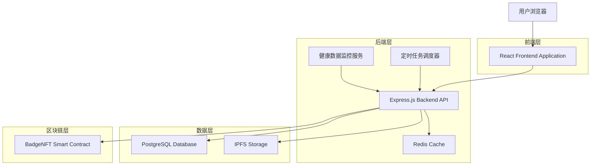
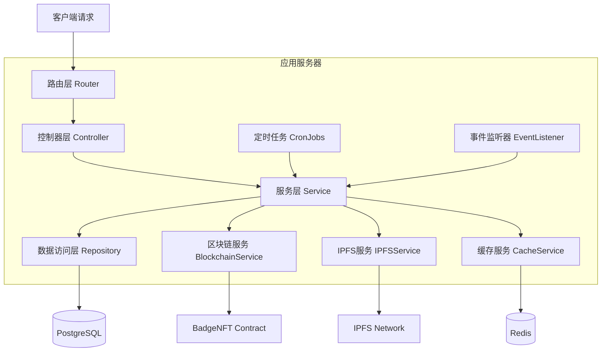
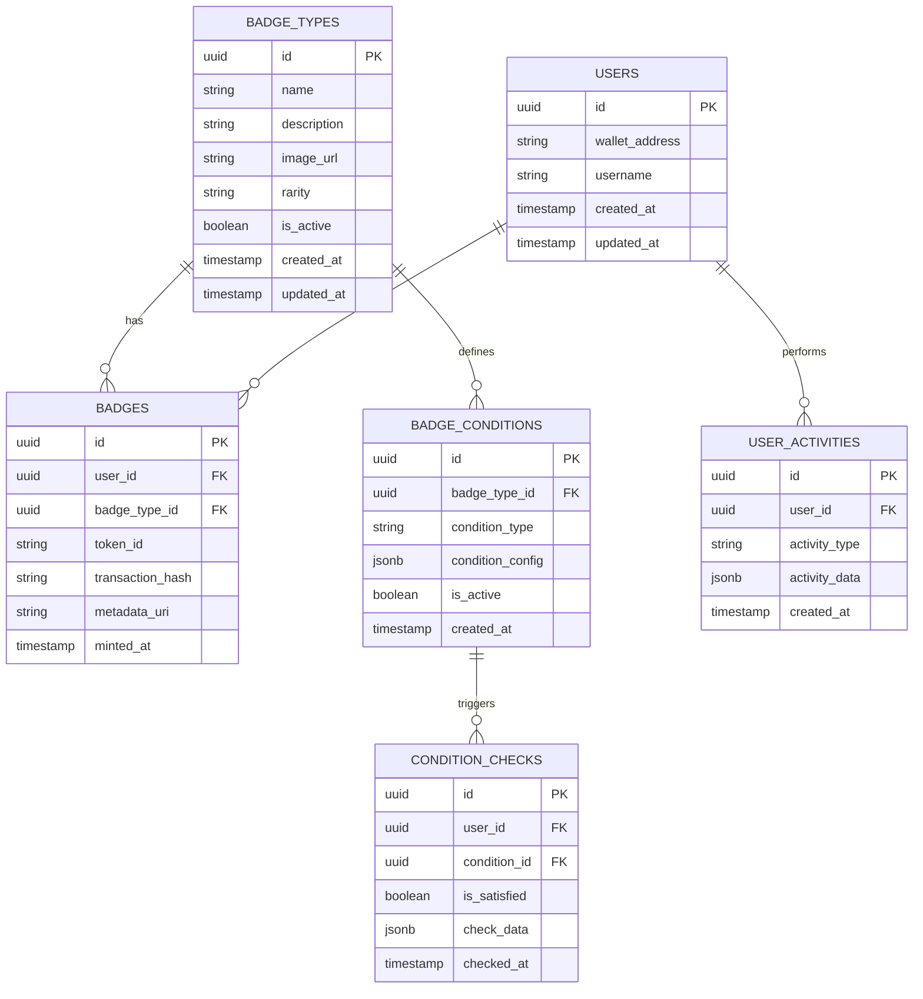

# LUMIEAI BadgeNFT勋章系统技术架构文档

## 1. 架构设计



## 2. 技术描述

* 前端：React\@18 + TypeScript + TailwindCSS + Vite

* 后端：Express.js\@4 + TypeScript + Node.js

* 数据库：PostgreSQL + Redis

* 区块链：Solidity + Hardhat + Ethers.js

* 存储：IPFS (勋章图片和元数据)

* 定时任务：node-cron

## 3. 路由定义

| 路由                       | 用途                  |
| ------------------------ | ------------------- |
| /badges                  | 勋章墙页面，展示用户获得的所有勋章   |
| /badges/:badgeId         | 勋章详情页面，显示单个勋章的详细信息  |
| /badges/admin            | 勋章管理页面，管理员配置勋章类型和条件 |
| /badges/admin/create     | 创建新勋章类型页面           |
| /badges/admin/conditions | 勋章条件配置页面            |

## 4. API定义

### 4.1 核心API

#### 勋章查询相关

```
GET /api/badges/user/:userId
```

请求参数：

| 参数名    | 参数类型   | 是否必需 | 描述   |
| ------ | ------ | ---- | ---- |
| userId | string | true | 用户ID |

响应：

| 参数名        | 参数类型     | 描述        |
| ---------- | -------- | --------- |
| badges     | Badge\[] | 用户获得的勋章列表 |
| totalCount | number   | 总勋章数量     |
| rareCount  | number   | 稀有勋章数量    |

示例：

```json
{
  "badges": [
    {
      "id": "badge_001",
      "name": "连续打卡7天",
      "description": "连续7天完成健康打卡",
      "imageUrl": "ipfs://QmXXX...",
      "rarity": "common",
      "mintedAt": "2024-01-15T10:30:00Z",
      "tokenId": "123"
    }
  ],
  "totalCount": 15,
  "rareCount": 3
}
```

#### 勋章铸造相关

```
POST /api/badges/mint
```

请求参数：

| 参数名         | 参数类型   | 是否必需 | 描述     |
| ----------- | ------ | ---- | ------ |
| userId      | string | true | 用户钱包地址 |
| badgeTypeId | string | true | 勋章类型ID |
| metadata    | object | true | 勋章元数据  |

响应：

| 参数名             | 参数类型    | 描述           |
| --------------- | ------- | ------------ |
| success         | boolean | 铸造是否成功       |
| tokenId         | string  | NFT Token ID |
| transactionHash | string  | 区块链交易哈希      |

#### 勋章类型管理

```
POST /api/badges/types
```

请求参数：

| 参数名         | 参数类型   | 是否必需 | 描述                               |
| ----------- | ------ | ---- | -------------------------------- |
| name        | string | true | 勋章名称                             |
| description | string | true | 勋章描述                             |
| imageUrl    | string | true | 勋章图片URL                          |
| rarity      | string | true | 稀有度 (common/rare/epic/legendary) |
| conditions  | object | true | 获得条件配置                           |

#### 条件检查相关

```
POST /api/badges/check-conditions
```

请求参数：

| 参数名       | 参数类型   | 是否必需 | 描述   |
| --------- | ------ | ---- | ---- |
| userId    | string | true | 用户ID |
| eventType | string | true | 事件类型 |
| eventData | object | true | 事件数据 |

## 5. 服务器架构图



## 6. 数据模型

### 6.1 数据模型定义



### 6.2 数据定义语言

#### 勋章类型表 (badge\_types)

```sql
-- 创建表
CREATE TABLE badge_types (
    id UUID PRIMARY KEY DEFAULT gen_random_uuid(),
    name VARCHAR(100) NOT NULL,
    description TEXT,
    image_url TEXT NOT NULL,
    rarity VARCHAR(20) DEFAULT 'common' CHECK (rarity IN ('common', 'rare', 'epic', 'legendary')),
    is_active BOOLEAN DEFAULT true,
    created_at TIMESTAMP WITH TIME ZONE DEFAULT NOW(),
    updated_at TIMESTAMP WITH TIME ZONE DEFAULT NOW()
);

-- 创建索引
CREATE INDEX idx_badge_types_rarity ON badge_types(rarity);
CREATE INDEX idx_badge_types_active ON badge_types(is_active);

-- 初始数据
INSERT INTO badge_types (name, description, image_url, rarity) VALUES
('连续打卡7天', '连续7天完成健康打卡任务', 'ipfs://QmXXX...', 'common'),
('步数达人', '单日步数达到10000步', 'ipfs://QmYYY...', 'common'),
('运动坚持者', '连续30天进行运动', 'ipfs://QmZZZ...', 'rare'),
('数据贡献者', '累计上传1000条健康数据', 'ipfs://QmAAA...', 'epic'),
('早期用户', '前1000名注册用户', 'ipfs://QmBBB...', 'legendary');
```

#### 用户勋章表 (badges)

```sql
-- 创建表
CREATE TABLE badges (
    id UUID PRIMARY KEY DEFAULT gen_random_uuid(),
    user_id UUID NOT NULL,
    badge_type_id UUID NOT NULL REFERENCES badge_types(id),
    token_id VARCHAR(100) UNIQUE NOT NULL,
    transaction_hash VARCHAR(66) NOT NULL,
    metadata_uri TEXT NOT NULL,
    minted_at TIMESTAMP WITH TIME ZONE DEFAULT NOW(),
    UNIQUE(user_id, badge_type_id)
);

-- 创建索引
CREATE INDEX idx_badges_user_id ON badges(user_id);
CREATE INDEX idx_badges_badge_type ON badges(badge_type_id);
CREATE INDEX idx_badges_minted_at ON badges(minted_at DESC);
```

#### 勋章条件表 (badge\_conditions)

```sql
-- 创建表
CREATE TABLE badge_conditions (
    id UUID PRIMARY KEY DEFAULT gen_random_uuid(),
    badge_type_id UUID NOT NULL REFERENCES badge_types(id),
    condition_type VARCHAR(50) NOT NULL,
    condition_config JSONB NOT NULL,
    is_active BOOLEAN DEFAULT true,
    created_at TIMESTAMP WITH TIME ZONE DEFAULT NOW()
);

-- 创建索引
CREATE INDEX idx_badge_conditions_type ON badge_conditions(condition_type);
CREATE INDEX idx_badge_conditions_active ON badge_conditions(is_active);

-- 初始数据
INSERT INTO badge_conditions (badge_type_id, condition_type, condition_config) VALUES
((SELECT id FROM badge_types WHERE name = '连续打卡7天'), 'consecutive_checkin', '{"days": 7}'),
((SELECT id FROM badge_types WHERE name = '步数达人'), 'daily_steps', '{"steps": 10000}'),
((SELECT id FROM badge_types WHERE name = '运动坚持者'), 'consecutive_exercise', '{"days": 30}');
```

#### 用户活动表 (user\_activities)

```sql
-- 创建表
CREATE TABLE user_activities (
    id UUID PRIMARY KEY DEFAULT gen_random_uuid(),
    user_id UUID NOT NULL,
    activity_type VARCHAR(50) NOT NULL,
    activity_data JSONB NOT NULL,
    created_at TIMESTAMP WITH TIME ZONE DEFAULT NOW()
);

-- 创建索引
CREATE INDEX idx_user_activities_user_id ON user_activities(user_id);
CREATE INDEX idx_user_activities_type ON user_activities(activity_type);
CREATE INDEX idx_user_activities_created_at ON user_activities(created_at DESC);
```

## 7. 智能合约设计

### 7.1 BadgeNFT合约接口

```solidity
// SPDX-License-Identifier: MIT
pragma solidity ^0.8.19;

import "@openzeppelin/contracts/token/ERC721/ERC721.sol";
import "@openzeppelin/contracts/access/Ownable.sol";
import "@openzeppelin/contracts/utils/Counters.sol";

contract BadgeNFT is ERC721, Ownable {
    using Counters for Counters.Counter;
    Counters.Counter private _tokenIds;
    
    struct Badge {
        string name;
        string description;
        string rarity;
        uint256 mintedAt;
    }
    
    mapping(uint256 => Badge) public badges;
    mapping(address => mapping(string => bool)) public userBadges;
    
    event BadgeMinted(address indexed to, uint256 indexed tokenId, string badgeType);
    
    function mintBadge(
        address to,
        string memory name,
        string memory description,
        string memory rarity,
        string memory tokenURI
    ) external onlyOwner returns (uint256);
    
    function getUserBadges(address user) external view returns (uint256[] memory);
    
    function getBadgeInfo(uint256 tokenId) external view returns (Badge memory);
}
```

## 8. 自动化监控系统

### 8.1 条件检查服务

```typescript
class ConditionChecker {
    async checkUserConditions(userId: string, eventType: string, eventData: any) {
        const conditions = await this.getActiveConditions();
        
        for (const condition of conditions) {
            if (await this.evaluateCondition(userId, condition, eventData)) {
                await this.triggerBadgeMint(userId, condition.badgeTypeId);
            }
        }
    }
    
    private async evaluateCondition(userId: string, condition: BadgeCondition, eventData: any): Promise<boolean> {
        switch (condition.conditionType) {
            case 'consecutive_checkin':
                return this.checkConsecutiveCheckin(userId, condition.config.days);
            case 'daily_steps':
                return this.checkDailySteps(eventData.steps, condition.config.steps);
            case 'consecutive_exercise':
                return this.checkConsecutiveExercise(userId, condition.config.days);
            default:
                return false;
        }
    }
}
```

### 8.2 定时任务调度

```typescript
import cron from 'node-cron';

// 每日凌晨检查连续性条件
cron.schedule('0 0 * * *', async () => {
    await checkDailyConditions();
});

// 每小时检查累计条件
cron.schedule('0 * * * *', async () => {
    await checkCumulativeConditions();
});
```

