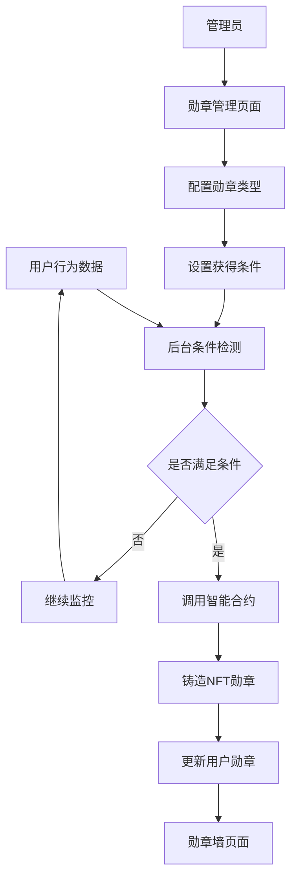

# LUMIEAI BadgeNFT勋章系统需求文档

## 1. 产品概述

LUMIEAI BadgeNFT勋章系统是一个基于区块链的成就认证平台，通过智能合约自动铸造NFT勋章来奖励用户在健康管理方面的积极行为和里程碑成就。

* 系统通过后台监控用户行为数据，当满足特定条件时自动为用户铸造相应的NFT勋章，激励用户持续参与健康管理活动。

* 前端提供勋章墙展示功能，让用户可以查看和分享自己获得的所有成就勋章，增强用户的成就感和社交互动。

## 2. 核心功能

### 2.1 用户角色

| 角色   | 注册方式   | 核心权限                 |
| ---- | ------ | -------------------- |
| 普通用户 | 钱包连接注册 | 查看勋章墙、获得勋章、分享成就      |
| 管理员  | 系统分配权限 | 管理勋章类型、查看系统统计、手动铸造勋章 |

### 2.2 功能模块

我们的BadgeNFT勋章系统包含以下主要页面：

1. **勋章墙页面**：用户勋章展示、勋章详情查看、成就分享功能。
2. **勋章详情页面**：单个勋章信息、获得条件、稀有度展示。
3. **勋章管理页面**：管理员勋章类型配置、条件设置、手动铸造。

### 2.3 页面详情

| 页面名称   | 模块名称   | 功能描述                           |
| ------ | ------ | ------------------------------ |
| 勋章墙页面  | 勋章展示区  | 网格布局展示用户获得的所有勋章，支持按类型、时间、稀有度筛选 |
| 勋章墙页面  | 成就统计   | 显示总勋章数量、稀有勋章数量、最近获得勋章等统计信息     |
| 勋章墙页面  | 分享功能   | 支持分享单个勋章或整个勋章墙到社交媒体            |
| 勋章详情页面 | 勋章信息   | 显示勋章名称、描述、获得时间、稀有度、获得条件等详细信息   |
| 勋章详情页面 | NFT属性  | 展示NFT的链上属性、合约地址、Token ID等区块链信息 |
| 勋章详情页面 | 获得条件   | 详细说明该勋章的获得条件和完成进度              |
| 勋章管理页面 | 勋章类型管理 | 创建、编辑、删除勋章类型，设置勋章图标、名称、描述      |
| 勋章管理页面 | 条件配置   | 设置自动铸造条件，包括数据阈值、时间要求、组合条件      |
| 勋章管理页面 | 手动铸造   | 管理员为特定用户手动铸造勋章，用于特殊活动或补发       |

## 3. 核心流程

### 3.1 用户获得勋章流程

用户通过日常健康管理活动产生数据，后台系统实时监控用户行为数据，当检测到用户满足特定勋章的获得条件时，自动调用智能合约为用户铸造相应的NFT勋章，用户在勋章墙页面可以查看新获得的勋章。

### 3.2 管理员管理流程

管理员登录管理页面，可以创建新的勋章类型并设置获得条件，系统根据配置的条件自动监控和铸造勋章，管理员也可以查看系统统计数据和为特定用户手动铸造勋章。

## 4. 用户界面设计

### 4.1 设计风格

* 主色调：深蓝色(#1E3A8A)和金色(#F59E0B)，体现成就感和专业性

* 按钮样式：圆角按钮配合渐变效果，突出重要操作

* 字体：主标题使用18px粗体，正文使用14px常规字体

* 布局风格：卡片式设计，网格布局展示勋章，顶部导航栏

* 图标风格：使用金属质感的勋章图标和成就相关的emoji表情

### 4.2 页面设计概览

| 页面名称   | 模块名称  | UI元素                                    |
| ------ | ----- | --------------------------------------- |
| 勋章墙页面  | 勋章展示区 | 6列网格布局，每个勋章卡片包含图标、名称、获得时间，hover效果显示详情预览 |
| 勋章墙页面  | 成就统计  | 顶部横向统计卡片，使用渐变背景和数字动画效果                  |
| 勋章墙页面  | 筛选器   | 左侧边栏筛选组件，支持按类型、稀有度、时间范围筛选               |
| 勋章详情页面 | 勋章展示  | 大尺寸勋章图标居中显示，配合发光动画效果                    |
| 勋章详情页面 | 信息面板  | 右侧信息卡片，包含勋章属性、获得条件、区块链信息                |
| 勋章管理页面 | 管理表格  | 数据表格展示所有勋章类型，支持内联编辑和批量操作                |
| 勋章管理页面 | 条件编辑器 | 可视化条件配置界面，支持拖拽组合多个条件                    |

### 4.3 响应式设计

系统采用移动优先的响应式设计，在手机端勋章展示改为2列布局，平板端为4列布局，桌面端为6列布局，支持触摸手势操作和移动端分享功能。

## 5. 勋章类型设计

### 5.1 健康管理勋章

* **连续打卡勋章**：连续7天、30天、100天完成健康打卡

* **步数达人勋章**：单日步数达到8000、10000、15000步

* **运动坚持勋章**：连续运动7天、30天、90天

* **体重管理勋章**：成功减重5kg、10kg、20kg

### 5.2 数据贡献勋章

* **数据上链勋章**：首次上传健康数据到区块链

* **数据贡献勋章**：累计上传100条、1000条、10000条健康数据

* **隐私保护勋章**：使用隐私保护功能上传敏感数据

### 5.3 社区参与勋章

* **早期用户勋章**：前1000名注册用户专属勋章

* **推荐达人勋章**：成功推荐5名、20名、50名新用户

* **社区贡献勋章**：参与社区活动、提供反馈建议

### 5.4 特殊成就勋章

* **里程碑勋章**：使用应用满1年、2年、5年

* **完美月份勋章**：单月完成所有健康目标

* **挑战胜利勋章**：参与并完成特定健康挑战活动

## 6. 自动化铸造条件

### 6.1 数据监控机制

* 实时监控用户的健康数据上传、运动记录、打卡行为

* 每日凌晨批量检查用户是否满足连续性条件

* 即时检查单次行为触发的勋章条件

### 6.2 条件判断逻辑

* **单一条件**：步数达到阈值、连续天数达标等简单条件

* **组合条件**：同时满足多个数据指标的复合条件

* **时间窗口条件**：在特定时间段内完成的条件

* **累计条件**：长期累计数据达到阈值的条件

### 6.3 防重复铸造

* 每个用户每种勋章类型只能获得一次

* 系统记录已铸造勋章，避免重复铸造

* 支持勋章升级机制，高级勋章替换低级勋章

