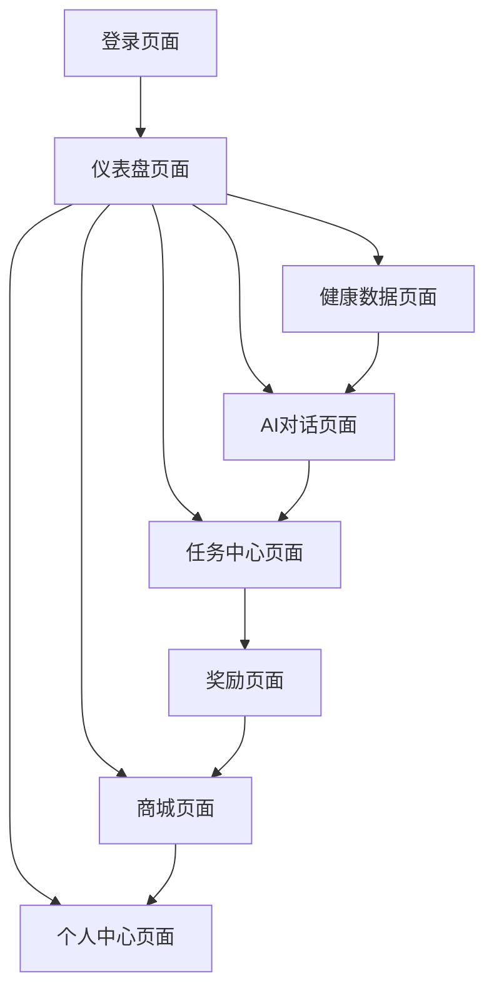

# LUMIEAI 产品需求文档

## 1. 产品概述
LUMIEAI是一款基于Web3技术的跨端健康管理应用，通过AI驱动的个性化健康建议和区块链技术确保数据安全与激励机制。
- 解决传统健康应用数据隐私问题和用户激励不足的痛点，为用户提供安全、透明、有激励的健康管理体验。
- 目标成为Web3健康管理领域的领先应用，建立用户健康数据的可信生态系统。

## 2. 核心功能

### 2.1 用户角色
| 角色 | 注册方式 | 核心权限 |
|------|----------|----------|
| 普通用户 | 邮箱注册或钱包连接 | 可使用基础健康管理功能、查看个人数据、参与任务 |
| 高级用户 | LUM代币订阅升级 | 可获得高级AI建议、专属NFT勋章、优先客服支持 |

### 2.2 功能模块
我们的LUMIEAI应用包含以下主要页面：
1. **登录页面**：邮箱登录、钱包连接、用户注册
2. **仪表盘页面**：健康数据概览、AI建议摘要、任务进度
3. **健康数据页面**：数据授权管理、数据可视化、历史记录
4. **AI对话页面**：智能健康咨询、个性化建议、7日微计划
5. **任务中心页面**：日常任务、挑战活动、进度跟踪
6. **奖励页面**：周度奖励查看、NFT勋章展示、积分管理
7. **商城页面**：健康产品购买、LUM代币支付、订单管理
8. **个人中心页面**：用户设置、数据确权、报告订阅

### 2.3 页面详情
| 页面名称 | 模块名称 | 功能描述 |
|----------|----------|----------|
| 登录页面 | 邮箱登录 | 支持邮箱密码登录，包含注册、忘记密码功能 |
| 登录页面 | 钱包连接 | 支持MetaMask等钱包连接，自动获取BSC地址 |
| 仪表盘页面 | 健康概览 | 显示关键健康指标、趋势图表、异常提醒 |
| 仪表盘页面 | AI建议卡片 | 展示个性化健康建议、快速操作入口 |
| 健康数据页面 | 数据授权 | 管理第三方应用数据访问权限、隐私设置 |
| 健康数据页面 | 数据可视化 | 多维度健康数据图表、时间范围筛选 |
| AI对话页面 | 智能对话 | AI健康咨询、症状分析、建议生成 |
| AI对话页面 | 微计划制定 | 7日个性化健康计划、目标设定、进度跟踪 |
| 任务中心页面 | 日常任务 | 步数、睡眠、饮食等基础任务管理 |
| 任务中心页面 | PoC验证 | 健康数据真实性验证、区块链存证 |
| 奖励页面 | 周度奖励 | 基于Merkle树的LUM代币奖励分发 |
| 奖励页面 | NFT勋章 | 成就勋章展示、稀有度标识、转让功能 |
| 商城页面 | 产品浏览 | 健康产品分类浏览、搜索筛选 |
| 商城页面 | LUM支付 | 仅支持LUM代币支付、交易确认、订单跟踪 |
| 个人中心页面 | 数据确权 | 健康数据上链确权、IPFS存储、Merkle Root验证 |
| 个人中心页面 | 报告订阅 | 健康报告订阅管理、自动生成、邮件推送 |

## 3. 核心流程

**用户注册登录流程：**
用户可通过邮箱注册或直接连接Web3钱包登录。邮箱用户需要验证邮箱并设置密码，钱包用户需要连接MetaMask等支持BSC的钱包。

**健康数据管理流程：**
用户授权第三方健康应用数据访问权限，系统自动同步并分析数据，生成可视化报告和AI建议。

**任务完成与奖励流程：**
用户完成日常健康任务，系统通过PoC机制验证数据真实性，每周通过Merkle树分发LUM代币奖励，优秀表现可获得NFT勋章。

## 4. 用户界面设计

### 4.1 设计风格
- **主色调**：健康绿 (#00C896) 和科技蓝 (#0066FF)
- **辅助色**：警告橙 (#FF6B35) 和中性灰 (#6B7280)
- **按钮风格**：圆角矩形，支持3D悬浮效果和渐变背景
- **字体**：中文使用苹方/思源黑体，英文使用Inter/Roboto，主要字号16px-24px
- **布局风格**：卡片式设计，顶部导航栏，底部Tab导航
- **图标风格**：线性图标配合健康主题emoji，支持动态效果

### 4.2 页面设计概览
| 页面名称 | 模块名称 | UI元素 |
|----------|----------|--------|
| 登录页面 | 邮箱登录 | 简洁表单设计，渐变背景，圆角输入框，主色调按钮 |
| 登录页面 | 钱包连接 | 钱包图标展示，连接状态指示，Web3风格设计元素 |
| 仪表盘页面 | 健康概览 | 卡片式布局，数据可视化图表，绿色健康指示器 |
| 仪表盘页面 | AI建议 | 对话气泡样式，AI头像，渐变背景，快速操作按钮 |
| 健康数据页面 | 数据可视化 | 交互式图表，时间轴选择器，多色数据线条 |
| AI对话页面 | 智能对话 | 聊天界面，消息气泡，输入框，发送按钮动画 |
| 任务中心页面 | 任务列表 | 进度条，完成状态图标，奖励预览，滑动操作 |
| 奖励页面 | NFT展示 | 3D卡片效果，稀有度光效，收藏网格布局 |
| 商城页面 | 产品列表 | 商品卡片，价格标签，LUM代币图标，购买按钮 |
| 个人中心页面 | 设置选项 | 列表式布局，开关控件，区块链状态指示器 |

### 4.3 响应式设计
应用采用移动端优先设计，支持iOS和Android平台的Flutter跨端适配。针对不同屏幕尺寸优化布局，支持横竖屏切换，确保触控元素不小于44px，满足无障碍访问要求。同时支持深色和浅色主题切换，适应用户使用习惯。