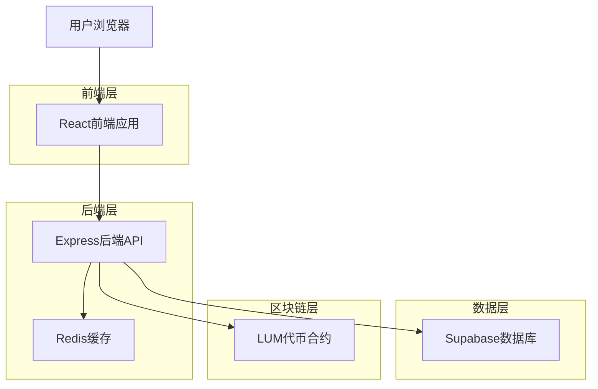
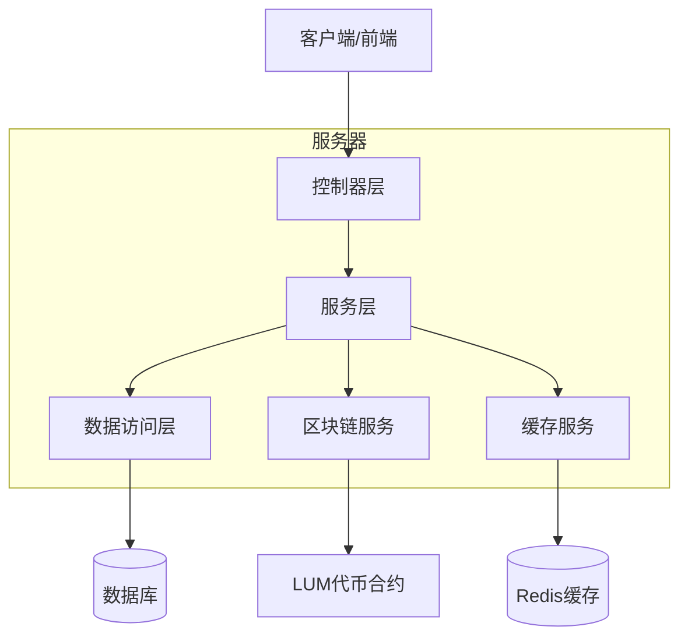
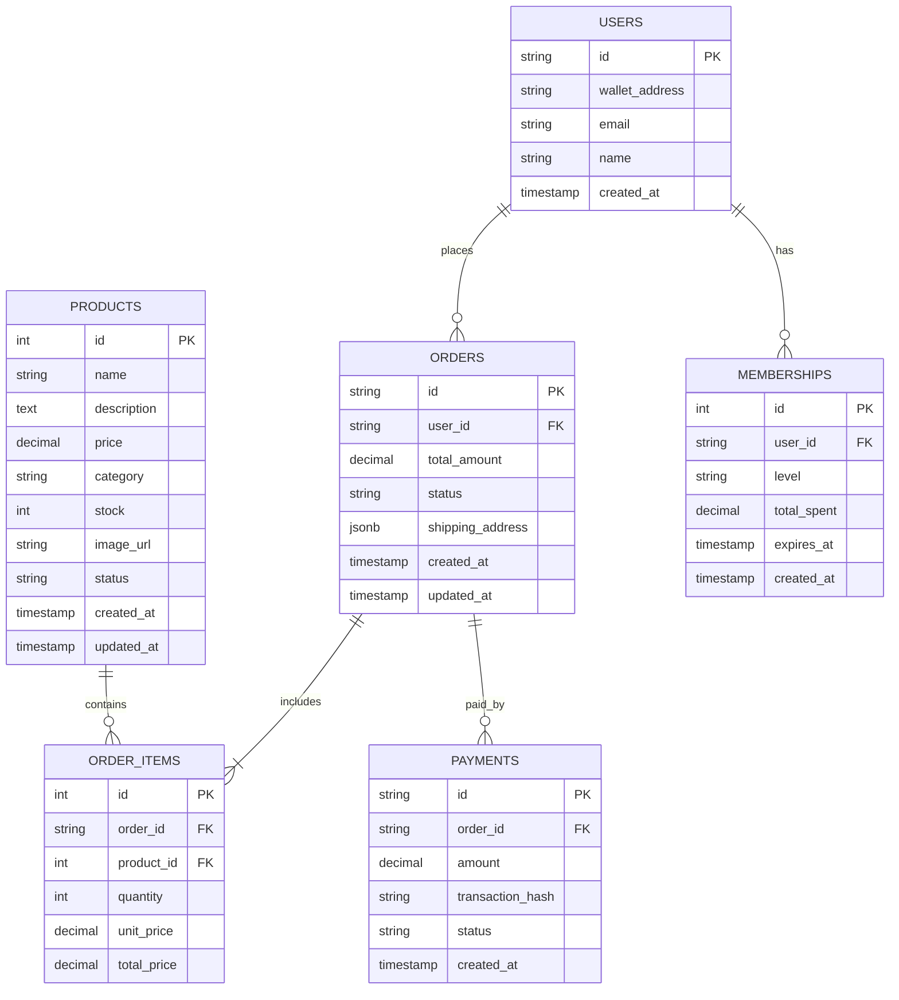

# LUMIEAI 会员/硬件兑换系统技术架构文档

## 1. 架构设计



## 2. 技术描述

* 前端：React\@18 + TypeScript + TailwindCSS + Vite

* 后端：Express\@4 + TypeScript + Node.js

* 数据库：Supabase (PostgreSQL)

* 区块链：Ethereum + Web3.js + LUM代币合约

* 缓存：Redis

* 状态管理：React Context + Zustand

## 3. 路由定义

| 路由               | 用途                  |
| ---------------- | ------------------- |
| /shop            | 商品展示页面，显示所有可兑换的商品列表 |
| /shop/:productId | 商品详情页面，显示单个商品的详细信息  |
| /cart            | 购物车页面，管理用户选择的商品     |
| /checkout        | 订单确认页面，填写收货信息并完成支付  |
| /orders          | 订单管理页面，查看用户的所有订单    |
| /orders/:orderId | 订单详情页面，显示单个订单的详细信息  |
| /membership      | 会员中心页面，显示会员等级和权益    |
| /admin/products  | 商品管理页面，管理员管理商品信息    |
| /admin/orders    | 订单处理页面，管理员处理订单状态    |
| /admin/inventory | 库存管理页面，管理员监控库存状态    |

## 4. API定义

### 4.1 商品管理API

**获取商品列表**

```
GET /api/products
```

请求参数：

| 参数名      | 参数类型   | 是否必需  | 描述                                       |
| -------- | ------ | ----- | ---------------------------------------- |
| category | string | false | 商品分类（membership/hardware）                |
| page     | number | false | 页码，默认1                                   |
| limit    | number | false | 每页数量，默认20                                |
| sort     | string | false | 排序方式（price\_asc/price\_desc/created\_at） |

响应：

| 参数名        | 参数类型   | 描述   |
| ---------- | ------ | ---- |
| products   | array  | 商品列表 |
| total      | number | 总数量  |
| page       | number | 当前页码 |
| totalPages | number | 总页数  |

示例：

```json
{
  "products": [
    {
      "id": 1,
      "name": "VIP会员月卡",
      "description": "享受专属权益30天",
      "price": 100,
      "category": "membership",
      "stock": 999,
      "image_url": "https://example.com/vip.jpg",
      "status": "active"
    }
  ],
  "total": 50,
  "page": 1,
  "totalPages": 3
}
```

**创建商品**

```
POST /api/products
```

请求：

| 参数名         | 参数类型   | 是否必需  | 描述      |
| ----------- | ------ | ----- | ------- |
| name        | string | true  | 商品名称    |
| description | string | true  | 商品描述    |
| price       | number | true  | LUM代币价格 |
| category    | string | true  | 商品分类    |
| stock       | number | true  | 库存数量    |
| image\_url  | string | false | 商品图片URL |

### 4.2 订单管理API

**创建订单**

```
POST /api/orders
```

请求：

| 参数名               | 参数类型   | 是否必需 | 描述       |
| ----------------- | ------ | ---- | -------- |
| user\_id          | string | true | 用户ID     |
| items             | array  | true | 订单商品列表   |
| shipping\_address | object | true | 收货地址     |
| total\_amount     | number | true | 总金额（LUM） |

响应：

| 参数名               | 参数类型    | 描述     |
| ----------------- | ------- | ------ |
| order\_id         | string  | 订单ID   |
| status            | string  | 订单状态   |
| payment\_required | boolean | 是否需要支付 |

**获取用户订单**

```
GET /api/orders/user/:userId
```

**更新订单状态**

```
PUT /api/orders/:orderId/status
```

### 4.3 支付API

**处理LUM支付**

```
POST /api/payments/lum
```

请求：

| 参数名               | 参数类型   | 是否必需 | 描述      |
| ----------------- | ------ | ---- | ------- |
| order\_id         | string | true | 订单ID    |
| transaction\_hash | string | true | 区块链交易哈希 |
| amount            | number | true | 支付金额    |
| from\_address     | string | true | 支付钱包地址  |

### 4.4 会员API

**获取会员信息**

```
GET /api/membership/:userId
```

**更新会员等级**

```
PUT /api/membership/:userId/upgrade
```

## 5. 服务器架构图



## 6. 数据模型

### 6.1 数据模型定义



### 6.2 数据定义语言

**商品表 (products)**

```sql
-- 创建商品表
CREATE TABLE products (
    id SERIAL PRIMARY KEY,
    name VARCHAR(255) NOT NULL,
    description TEXT,
    price DECIMAL(18,8) NOT NULL,
    category VARCHAR(50) NOT NULL CHECK (category IN ('membership', 'hardware')),
    stock INTEGER NOT NULL DEFAULT 0,
    image_url TEXT,
    status VARCHAR(20) DEFAULT 'active' CHECK (status IN ('active', 'inactive', 'out_of_stock')),
    metadata JSONB DEFAULT '{}',
    created_at TIMESTAMP WITH TIME ZONE DEFAULT NOW(),
    updated_at TIMESTAMP WITH TIME ZONE DEFAULT NOW()
);

-- 创建索引
CREATE INDEX idx_products_category ON products(category);
CREATE INDEX idx_products_status ON products(status);
CREATE INDEX idx_products_created_at ON products(created_at DESC);

-- 初始化数据
INSERT INTO products (name, description, price, category, stock, image_url) VALUES
('VIP会员月卡', '享受专属权益30天，包括优先客服、专属商品等', 100.0, 'membership', 999, 'https://example.com/vip-monthly.jpg'),
('VIP会员年卡', '享受专属权益365天，性价比最高的选择', 1000.0, 'membership', 999, 'https://example.com/vip-yearly.jpg'),
('LUMIE智能手环', '健康监测设备，支持心率、步数、睡眠监测', 500.0, 'hardware', 100, 'https://example.com/smart-band.jpg'),
('LUMIE智能体重秤', '精准体重测量，支持多用户识别', 300.0, 'hardware', 50, 'https://example.com/smart-scale.jpg'),
('LUMIE健康套装', '包含智能手环和体重秤的组合套装', 750.0, 'hardware', 30, 'https://example.com/health-kit.jpg');
```

**订单表 (orders)**

```sql
-- 创建订单表
CREATE TABLE orders (
    id UUID PRIMARY KEY DEFAULT gen_random_uuid(),
    user_id VARCHAR(255) NOT NULL,
    total_amount DECIMAL(18,8) NOT NULL,
    status VARCHAR(20) DEFAULT 'pending' CHECK (status IN ('pending', 'paid', 'processing', 'shipped', 'completed', 'cancelled')),
    shipping_address JSONB NOT NULL,
    tracking_number VARCHAR(100),
    notes TEXT,
    created_at TIMESTAMP WITH TIME ZONE DEFAULT NOW(),
    updated_at TIMESTAMP WITH TIME ZONE DEFAULT NOW()
);

-- 创建索引
CREATE INDEX idx_orders_user_id ON orders(user_id);
CREATE INDEX idx_orders_status ON orders(status);
CREATE INDEX idx_orders_created_at ON orders(created_at DESC);
```

**订单商品表 (order\_items)**

```sql
-- 创建订单商品表
CREATE TABLE order_items (
    id SERIAL PRIMARY KEY,
    order_id UUID NOT NULL REFERENCES orders(id) ON DELETE CASCADE,
    product_id INTEGER NOT NULL REFERENCES products(id),
    quantity INTEGER NOT NULL DEFAULT 1,
    unit_price DECIMAL(18,8) NOT NULL,
    total_price DECIMAL(18,8) NOT NULL,
    created_at TIMESTAMP WITH TIME ZONE DEFAULT NOW()
);

-- 创建索引
CREATE INDEX idx_order_items_order_id ON order_items(order_id);
CREATE INDEX idx_order_items_product_id ON order_items(product_id);
```

**会员表 (memberships)**

```sql
-- 创建会员表
CREATE TABLE memberships (
    id SERIAL PRIMARY KEY,
    user_id VARCHAR(255) UNIQUE NOT NULL,
    level VARCHAR(20) DEFAULT 'basic' CHECK (level IN ('basic', 'vip', 'premium')),
    total_spent DECIMAL(18,8) DEFAULT 0,
    expires_at TIMESTAMP WITH TIME ZONE,
    benefits JSONB DEFAULT '{}',
    created_at TIMESTAMP WITH TIME ZONE DEFAULT NOW(),
    updated_at TIMESTAMP WITH TIME ZONE DEFAULT NOW()
);

-- 创建索引
CREATE INDEX idx_memberships_user_id ON memberships(user_id);
CREATE INDEX idx_memberships_level ON memberships(level);
```

**支付表 (payments)**

```sql
-- 创建支付表
CREATE TABLE payments (
    id UUID PRIMARY KEY DEFAULT gen_random_uuid(),
    order_id UUID NOT NULL REFERENCES orders(id),
    amount DECIMAL(18,8) NOT NULL,
    transaction_hash VARCHAR(66) UNIQUE NOT NULL,
    from_address VARCHAR(42) NOT NULL,
    to_address VARCHAR(42) NOT NULL,
    status VARCHAR(20) DEFAULT 'pending' CHECK (status IN ('pending', 'confirmed', 'failed')),
    block_number BIGINT,
    gas_used BIGINT,
    created_at TIMESTAMP WITH TIME ZONE DEFAULT NOW()
);

-- 创建索引
CREATE INDEX idx_payments_order_id ON payments(order_id);
CREATE INDEX idx_payments_transaction_hash ON payments(transaction_hash);
CREATE INDEX idx_payments_status ON payments(status);
```

**权限设置**

```sql
-- 授予权限
GRANT SELECT ON products TO anon;
GRANT ALL PRIVILEGES ON products TO authenticated;
GRANT ALL PRIVILEGES ON orders TO authenticated;
GRANT ALL PRIVILEGES ON order_items TO authenticated;
GRANT ALL PRIVILEGES ON memberships TO authenticated;
GRANT ALL PRIVILEGES ON payments TO authenticated;

-- 启用行级安全
ALTER TABLE orders ENABLE ROW LEVEL SECURITY;
ALTER TABLE memberships ENABLE ROW LEVEL SECURITY;
ALTER TABLE payments ENABLE ROW LEVEL SECURITY;

-- 创建RLS策略
CREATE POLICY "Users can view their own orders" ON orders
    FOR SELECT USING (user_id = current_setting('request.jwt.claims', true)::json->>'sub');

CREATE POLICY "Users can create their own orders" ON orders
    FOR INSERT WITH CHECK (user_id = current_setting('request.jwt.claims', true)::json->>'sub');
```

