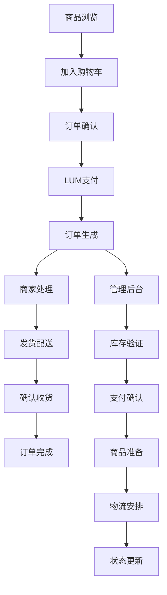

# LUMIEAI 会员/硬件兑换系统需求文档

## 1. 产品概述

LUMIEAI会员/硬件兑换系统是一个基于LUM代币的电商兑换平台，用户可以使用LUM代币兑换会员权益和硬件商品。
系统提供完整的订单管理流程，支持库存管理、订单状态跟踪和用户兑换历史记录。
目标是为LUMIEAI生态系统用户提供便捷的代币消费场景，增强代币实用性和用户粘性。

## 2. 核心功能

### 2.1 用户角色

| 角色    | 注册方式            | 核心权限                |
| ----- | --------------- | ------------------- |
| 普通用户  | 钱包连接注册          | 浏览商品、下单兑换、查看订单历史    |
| VIP会员 | 达到一定LUM持有量或消费额度 | 享受会员专属商品、优先发货、专属客服  |
| 管理员   | 系统分配            | 商品管理、订单处理、库存管理、用户管理 |

### 2.2 功能模块

我们的会员/硬件兑换系统包含以下主要页面：

1. **商品展示页面**：商品分类浏览、搜索筛选、商品详情展示。
2. **购物车页面**：商品添加、数量调整、价格计算。
3. **订单确认页面**：收货信息填写、LUM余额确认、订单提交。
4. **订单管理页面**：订单状态查看、物流跟踪、订单历史。
5. **会员中心页面**：会员等级、专属权益、兑换记录。
6. **管理后台页面**：商品管理、订单处理、库存监控。

### 2.3 页面详情

| 页面名称   | 模块名称  | 功能描述                                     |
| ------ | ----- | ---------------------------------------- |
| 商品展示页面 | 商品列表  | 展示所有可兑换商品，支持分类筛选（会员权益/硬件商品）、价格排序、库存状态显示  |
| 商品展示页面 | 商品详情  | 显示商品图片、详细描述、LUM价格、库存数量、用户评价、兑换按钮         |
| 购物车页面  | 购物车管理 | 添加/删除商品、数量调整、总价计算、LUM余额检查、批量操作           |
| 订单确认页面 | 订单信息  | 收货地址填写、联系方式确认、商品清单展示、LUM扣款确认             |
| 订单确认页面 | 支付处理  | LUM代币余额验证、扣款操作、交易哈希记录、支付状态反馈             |
| 订单管理页面 | 订单列表  | 显示用户所有订单，支持状态筛选（待支付/已支付/处理中/已发货/已完成/已取消） |
| 订单管理页面 | 订单详情  | 订单商品信息、支付记录、物流信息、操作按钮（取消/确认收货/申请退款）      |
| 会员中心页面 | 会员信息  | 会员等级显示、升级条件、专属权益列表、LUM消费统计               |
| 会员中心页面 | 兑换记录  | 历史兑换记录、LUM消费明细、订单状态统计、月度/年度报表            |
| 管理后台页面 | 商品管理  | 商品CRUD操作、库存管理、价格设置、上架/下架、分类管理            |
| 管理后台页面 | 订单处理  | 订单状态更新、发货处理、退款审核、客服处理、数据统计               |

## 3. 核心流程

**用户兑换流程：**
用户浏览商品 → 选择商品加入购物车 → 确认订单信息 → LUM代币支付 → 订单生成 → 商家处理 → 发货配送 → 用户确认收货 → 订单完成

**管理员处理流程：**
接收订单 → 验证库存 → 确认支付 → 准备商品 → 安排发货 → 更新物流信息 → 处理售后

## 4. 用户界面设计

### 4.1 设计风格

* **主色调**：深蓝色 (#1e3a8a) 和金色 (#fbbf24)

* **按钮样式**：圆角按钮，渐变效果，悬停动画

* **字体**：主标题使用 24px 粗体，正文使用 16px 常规字体

* **布局风格**：卡片式设计，网格布局，顶部导航栏

* **图标风格**：线性图标，购物车、订单、会员等主题图标

### 4.2 页面设计概览

| 页面名称   | 模块名称  | UI元素                               |
| ------ | ----- | ---------------------------------- |
| 商品展示页面 | 商品网格  | 卡片式商品展示，图片、标题、价格、库存状态，深蓝色背景，金色价格标签 |
| 购物车页面  | 购物车列表 | 商品缩略图、数量选择器、价格计算，总计显示，金色结算按钮       |
| 订单确认页面 | 支付界面  | LUM余额显示、扣款金额确认、深蓝色支付按钮，支付状态动画      |
| 订单管理页面 | 订单卡片  | 订单状态标签（不同颜色），商品信息，操作按钮，时间轴样式       |
| 会员中心页面 | 会员卡片  | 等级徽章、权益列表、进度条，金色会员标识，深蓝色背景         |
| 管理后台页面 | 数据面板  | 统计图表、订单列表、库存警告，深色主题，金色强调色          |

### 4.3 响应式设计

系统采用移动端优先的响应式设计，支持桌面端、平板端和移动端访问，针对触屏操作进行优化。

## 5. 技术要求

### 5.1 集成要求

* **LUM代币系统**：集成现有LUM代币合约，支持余额查询和转账操作

* **用户钱包**：支持MetaMask等Web3钱包连接，实现代币支付

* **数据库系统**：使用Supabase PostgreSQL存储商品、订单、用户数据

* **支付系统**：基于区块链的LUM代币支付，确保交易安全和透明

### 5.2 性能要求

* 页面加载时间不超过3秒

* 支付处理时间不超过30秒

* 支持1000+并发用户访问

* 99.9%系统可用性保证

### 5.3 安全要求

* 用户钱包私钥本地存储，不上传服务器

* 订单数据加密存储

* 支付交易上链记录，防篡改

* 管理员权限分级控制

