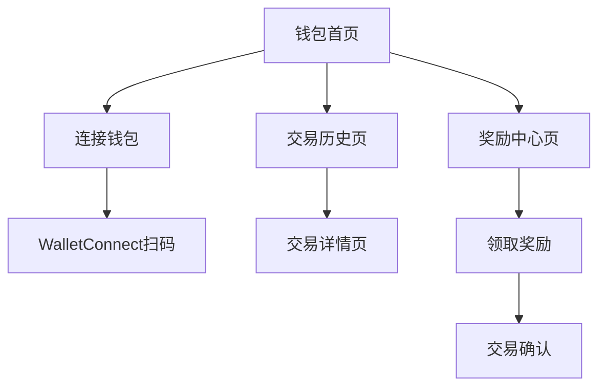

# LUMIEAI 区块链钱包功能需求文档

## 1. 产品概述

LUMIEAI区块链钱包功能是健康激励应用的核心组件，通过集成WalletConnect v2协议，为用户提供安全便捷的LUM代币管理体验。用户可以连接外部钱包、查看代币余额、管理交易历史，并通过完成健康任务获得LUM代币奖励。

该功能将健康数据与区块链激励机制深度融合，为用户创造真实的价值回报，提升用户参与健康管理的积极性。

## 2. 核心功能

### 2.1 用户角色

| 角色 | 注册方式 | 核心权限 |
|------|----------|----------|
| 普通用户 | 邮箱注册 + 钱包连接 | 查看余额、接收奖励、基础交易 |
| 高级用户 | 完成KYC验证 | 高额转账、质押功能、治理投票 |

### 2.2 功能模块

我们的区块链钱包功能包含以下核心页面：
1. **钱包首页**：余额显示、快速操作、连接状态
2. **交易历史页**：交易记录、筛选排序、详情查看
3. **连接管理页**：WalletConnect会话、网络切换、安全设置
4. **奖励中心页**：任务奖励、领取记录、奖励规则

### 2.3 页面详情

| 页面名称 | 模块名称 | 功能描述 |
|----------|----------|----------|
| 钱包首页 | 余额卡片 | 显示LUM代币余额，支持刷新和隐藏功能 |
| 钱包首页 | 快速操作 | 发送、接收、质押等常用操作入口 |
| 钱包首页 | 连接状态 | WalletConnect连接状态，支持连接/断开 |
| 钱包首页 | 网络信息 | 显示当前网络（BSC Testnet），支持切换 |
| 交易历史页 | 交易列表 | 显示所有LUM代币交易记录，包含时间、金额、状态 |
| 交易历史页 | 筛选器 | 按类型、时间、状态筛选交易记录 |
| 交易历史页 | 交易详情 | 查看交易哈希、区块确认、Gas费用等详细信息 |
| 连接管理页 | 会话管理 | 管理WalletConnect活跃会话，支持断开连接 |
| 连接管理页 | 网络设置 | 配置RPC节点、切换测试/主网 |
| 连接管理页 | 安全设置 | 交易确认、生物识别、会话超时设置 |
| 奖励中心页 | 待领取奖励 | 显示完成任务获得的LUM奖励，支持一键领取 |
| 奖励中心页 | 奖励历史 | 查看历史奖励记录和领取状态 |
| 奖励中心页 | 奖励规则 | 展示不同健康任务对应的LUM奖励标准 |

## 3. 核心流程

### 用户操作流程

**钱包连接流程：**
用户进入钱包页面 → 点击连接钱包 → 扫描WalletConnect二维码 → 在外部钱包确认连接 → 连接成功，显示余额

**奖励领取流程：**
用户完成健康任务 → 系统计算奖励 → 奖励显示在待领取列表 → 用户点击领取 → 发起区块链交易 → 交易确认后奖励到账

**交易查询流程：**
用户进入交易历史 → 查看交易列表 → 点击具体交易 → 查看交易详情 → 可跳转区块链浏览器查看

## 4. 用户界面设计

### 4.1 设计风格

- **主色调**：#6366F1（紫色）、#10B981（绿色）
- **按钮样式**：圆角12px，渐变背景，阴影效果
- **字体**：SF Pro Display（iOS）/ Roboto（Android），主要字号16px
- **布局风格**：卡片式设计，顶部导航，底部Tab栏
- **图标风格**：线性图标，支持深色模式，钱包、代币、交易相关图标

### 4.2 页面设计概览

| 页面名称 | 模块名称 | UI元素 |
|----------|----------|--------|
| 钱包首页 | 余额卡片 | 渐变背景卡片，大号数字显示，眼睛图标隐藏/显示 |
| 钱包首页 | 操作按钮 | 圆形图标按钮，发送/接收/质押，底部固定布局 |
| 钱包首页 | 连接状态 | 绿色/红色状态指示器，连接地址缩略显示 |
| 交易历史页 | 交易项 | 左侧图标，中间信息，右侧金额，时间戳显示 |
| 交易历史页 | 筛选栏 | 下拉选择器，日期选择器，状态标签 |
| 连接管理页 | 会话卡片 | 钱包图标，连接时间，操作按钮 |
| 奖励中心页 | 奖励卡片 | 任务图标，奖励金额，领取按钮，进度条 |

### 4.3 响应式设计

产品采用移动端优先设计，支持iOS和Android平台，针对不同屏幕尺寸进行适配，确保在各种设备上都有良好的用户体验。支持横屏模式下的布局调整。
