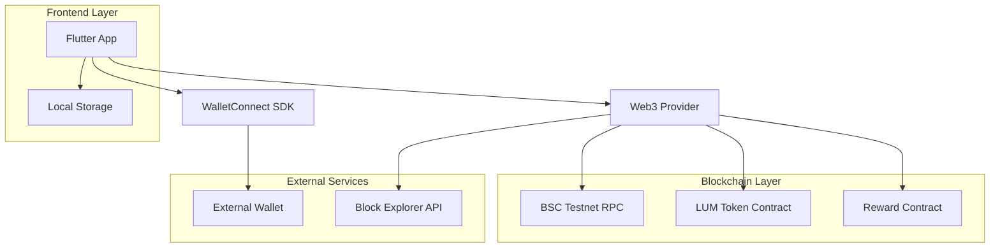
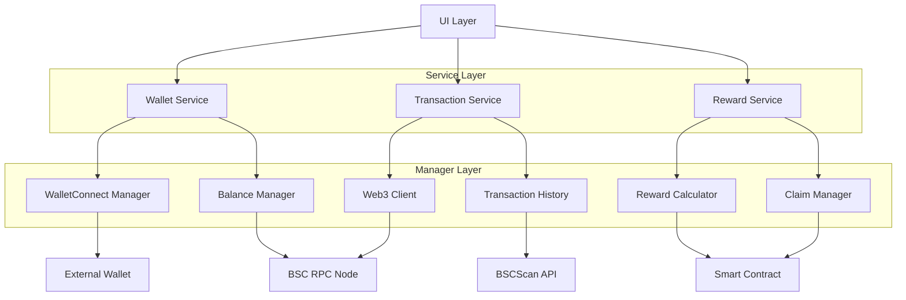
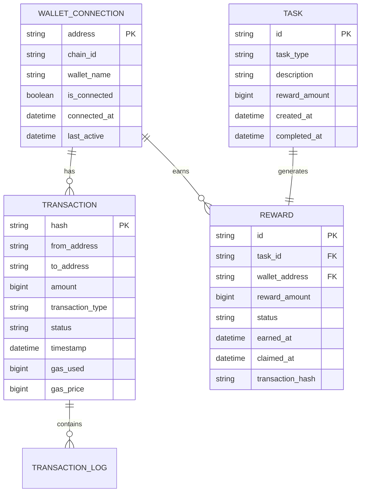

# LUMIEAI 区块链钱包技术架构文档

## 1. 架构设计



## 2. 技术描述

* **Frontend**: Flutter\@3.35 + walletconnect\_flutter\_v2\@2.1.0 + web3dart\@3.1.0

* **Blockchain**: BSC Testnet + Solidity Smart Contracts

* **Storage**: SharedPreferences + Hive Database

* **Network**: HTTP Client + WebSocket (WalletConnect)

## 3. 路由定义

| 路由                        | 用途              |
| ------------------------- | --------------- |
| /wallet                   | 钱包首页，显示余额和快速操作  |
| /wallet/history           | 交易历史页面，显示所有交易记录 |
| /wallet/connect           | 钱包连接管理页面        |
| /wallet/rewards           | 奖励中心页面，管理任务奖励   |
| /wallet/transaction/:hash | 交易详情页面          |
| /wallet/send              | 发送代币页面          |
| /wallet/receive           | 接收代币页面          |

## 4. API定义

### 4.1 核心API

**WalletConnect连接**

```dart
// 初始化WalletConnect会话
Future<void> initializeWalletConnect()

// 连接钱包
Future<SessionData> connectWallet()

// 断开连接
Future<void> disconnectWallet()
```

**代币余额查询**

```dart
// 查询LUM代币余额
Future<BigInt> getLumBalance(String address)

// 查询BNB余额
Future<EtherAmount> getBnbBalance(String address)
```

**交易操作**

```dart
// 发送LUM代币
Future<String> sendLumTokens({
  required String toAddress,
  required BigInt amount,
  BigInt? gasPrice,
})

// 领取奖励
Future<String> claimRewards({
  required String taskId,
  required BigInt rewardAmount,
})
```

**交易历史**

```dart
// 获取交易历史
Future<List<Transaction>> getTransactionHistory({
  required String address,
  int? limit,
  String? fromBlock,
})

// 获取交易详情
Future<TransactionReceipt> getTransactionDetails(String hash)
```

### 4.2 数据模型

```dart
// 钱包连接状态
class WalletConnectionState {
  final bool isConnected;
  final String? address;
  final String? chainId;
  final String? walletName;
  final DateTime? connectedAt;
}

// LUM代币余额
class LumBalance {
  final BigInt balance;
  final String formattedBalance;
  final double usdValue;
  final DateTime lastUpdated;
}

// 交易记录
class LumTransaction {
  final String hash;
  final String from;
  final String to;
  final BigInt amount;
  final String type; // 'send', 'receive', 'reward'
  final TransactionStatus status;
  final DateTime timestamp;
  final BigInt? gasUsed;
  final BigInt? gasPrice;
}

// 奖励信息
class TaskReward {
  final String taskId;
  final String taskType;
  final BigInt rewardAmount;
  final RewardStatus status;
  final DateTime earnedAt;
  final DateTime? claimedAt;
  final String? transactionHash;
}
```

## 5. 服务架构图



## 6. 数据模型

### 6.1 数据模型定义



### 6.2 数据定义语言

**钱包连接表 (wallet\_connections)**

```sql
-- 创建钱包连接表
CREATE TABLE wallet_connections (
    address VARCHAR(42) PRIMARY KEY,
    chain_id VARCHAR(10) NOT NULL DEFAULT '97', -- BSC Testnet
    wallet_name VARCHAR(50),
    is_connected BOOLEAN DEFAULT false,
    connected_at TIMESTAMP DEFAULT CURRENT_TIMESTAMP,
    last_active TIMESTAMP DEFAULT CURRENT_TIMESTAMP,
    session_data TEXT -- WalletConnect会话数据
);

-- 创建索引
CREATE INDEX idx_wallet_connections_active ON wallet_connections(is_connected, last_active);
```

**交易记录表 (lum\_transactions)**

```sql
-- 创建交易表
CREATE TABLE lum_transactions (
    hash VARCHAR(66) PRIMARY KEY,
    from_address VARCHAR(42) NOT NULL,
    to_address VARCHAR(42) NOT NULL,
    amount DECIMAL(36, 18) NOT NULL,
    transaction_type VARCHAR(20) NOT NULL, -- 'send', 'receive', 'reward', 'claim'
    status VARCHAR(20) DEFAULT 'pending', -- 'pending', 'confirmed', 'failed'
    block_number BIGINT,
    timestamp TIMESTAMP DEFAULT CURRENT_TIMESTAMP,
    gas_used BIGINT,
    gas_price BIGINT,
    created_at TIMESTAMP DEFAULT CURRENT_TIMESTAMP
);

-- 创建索引
CREATE INDEX idx_transactions_address ON lum_transactions(from_address, timestamp DESC);
CREATE INDEX idx_transactions_to_address ON lum_transactions(to_address, timestamp DESC);
CREATE INDEX idx_transactions_type ON lum_transactions(transaction_type, timestamp DESC);
```

**奖励记录表 (task\_rewards)**

```sql
-- 创建奖励表
CREATE TABLE task_rewards (
    id VARCHAR(36) PRIMARY KEY,
    task_id VARCHAR(36) NOT NULL,
    wallet_address VARCHAR(42) NOT NULL,
    reward_amount DECIMAL(36, 18) NOT NULL,
    status VARCHAR(20) DEFAULT 'pending', -- 'pending', 'claimed', 'expired'
    earned_at TIMESTAMP DEFAULT CURRENT_TIMESTAMP,
    claimed_at TIMESTAMP NULL,
    transaction_hash VARCHAR(66) NULL,
    expiry_date TIMESTAMP NULL
);

-- 创建索引
CREATE INDEX idx_rewards_wallet ON task_rewards(wallet_address, status, earned_at DESC);
CREATE INDEX idx_rewards_task ON task_rewards(task_id, status);

-- 初始化数据
INSERT INTO task_rewards (id, task_id, wallet_address, reward_amount, status, earned_at)
VALUES 
('reward_001', 'task_daily_steps', '0x742d35Cc6634C0532925a3b8D', 100.0, 'pending', NOW()),
('reward_002', 'task_weekly_exercise', '0x742d35Cc6634C0532925a3b8D', 500.0, 'pending', NOW());
```

**智能合约配置表 (contract\_config)**

```sql
-- 创建合约配置表
CREATE TABLE contract_config (
    id VARCHAR(50) PRIMARY KEY,
    contract_address VARCHAR(42) NOT NULL,
    contract_abi TEXT NOT NULL,
    network_id VARCHAR(10) NOT NULL,
    is_active BOOLEAN DEFAULT true,
    created_at TIMESTAMP DEFAULT CURRENT_TIMESTAMP
);

-- 初始化合约配置
INSERT INTO contract_config (id, contract_address, network_id)
VALUES 
('lum_token_bsc_testnet', '0x...', '97'),
('reward_distributor_bsc_testnet', '0x...', '97');
```

