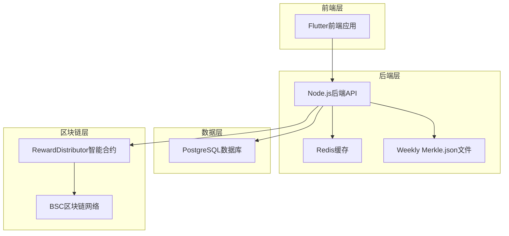
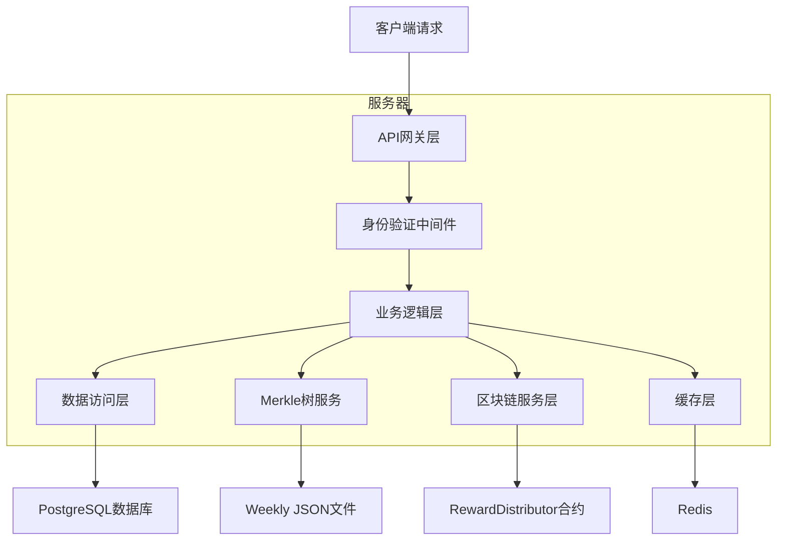
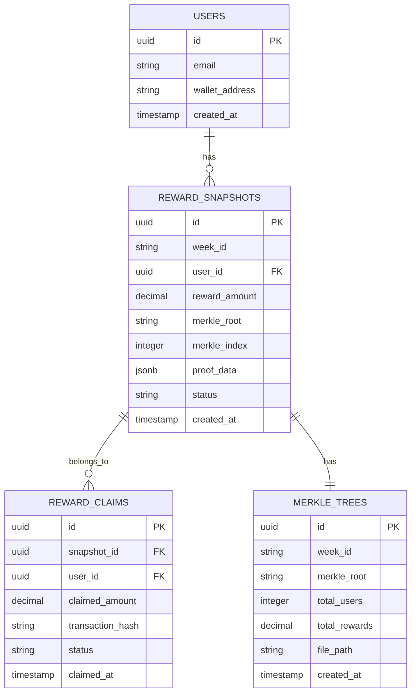

# LUMIEAI 奖励分发系统技术架构文档

## 1. 架构设计



## 2. 技术描述

* 前端：Flutter\@3.16 + Provider状态管理 + web3dart区块链交互

* 后端：Node.js\@20 + Express\@4 + TypeScript + Merkle树算法

* 数据库：PostgreSQL\@15（主数据库）+ Redis\@7（缓存）

* 区块链：Solidity\@0.8.19 + Hardhat开发框架 + BSC Testnet

* 文件存储：本地JSON文件存储 + IPFS（可选）

## 3. 路由定义

| 路由               | 用途                     |
| ---------------- | ---------------------- |
| /rewards         | 奖励中心主页面，显示用户奖励概览和可领取奖励 |
| /rewards/claim   | 奖励领取页面，用户领取LUM代币奖励     |
| /rewards/history | 奖励历史页面，查看历史领取记录        |
| /rewards/admin   | 奖励管理页面，管理员生成奖励快照和系统配置  |

## 4. API定义

### 4.1 核心API

#### 生成每周奖励快照

```
POST /api/rewards/generate-snapshot
```

请求参数：

| 参数名       | 参数类型   | 是否必需 | 描述                  |
| --------- | ------ | ---- | ------------------- |
| weekStart | string | true | 周开始日期（YYYY-MM-DD格式） |
| weekEnd   | string | true | 周结束日期（YYYY-MM-DD格式） |
| adminKey  | string | true | 管理员密钥               |

响应参数：

| 参数名          | 参数类型    | 描述              |
| ------------ | ------- | --------------- |
| success      | boolean | 生成是否成功          |
| snapshotId   | string  | 快照ID            |
| merkleRoot   | string  | Merkle树根哈希      |
| totalRewards | string  | 总奖励金额           |
| userCount    | number  | 参与用户数           |
| filePath     | string  | merkle.json文件路径 |

#### 获取用户奖励信息

```
GET /api/rewards/user/:userId
```

响应参数：

| 参数名              | 参数类型   | 描述     |
| ---------------- | ------ | ------ |
| totalRewards     | string | 用户总奖励  |
| claimableRewards | string | 可领取奖励  |
| claimedRewards   | string | 已领取奖励  |
| weeklyRewards    | array  | 每周奖励详情 |
| lastClaimTime    | number | 最后领取时间 |

#### 获取Merkle证明

```
GET /api/rewards/proof/:userId/:weekId
```

响应参数：

| 参数名        | 参数类型      | 描述             |
| ---------- | --------- | -------------- |
| proof      | string\[] | Merkle证明路径     |
| amount     | string    | 奖励金额           |
| index      | number    | 用户在Merkle树中的索引 |
| merkleRoot | string    | Merkle树根哈希     |

#### 验证奖励领取

```
POST /api/rewards/verify-claim
```

请求参数：

| 参数名             | 参数类型      | 是否必需 | 描述       |
| --------------- | --------- | ---- | -------- |
| userId          | string    | true | 用户ID     |
| weekId          | string    | true | 周期ID     |
| amount          | string    | true | 奖励金额     |
| proof           | string\[] | true | Merkle证明 |
| transactionHash | string    | true | 交易哈希     |

响应参数：

| 参数名     | 参数类型    | 描述     |
| ------- | ------- | ------ |
| success | boolean | 验证是否成功 |
| claimed | boolean | 是否已领取  |
| valid   | boolean | 证明是否有效 |

#### 获取奖励历史

```
GET /api/rewards/history/:userId
```

请求参数：

| 参数名    | 参数类型   | 是否必需  | 描述                    |
| ------ | ------ | ----- | --------------------- |
| page   | number | false | 页码，默认1                |
| limit  | number | false | 每页数量，默认20             |
| status | string | false | 状态筛选（claimed/pending） |

## 5. 服务器架构图



## 6. 数据模型

### 6.1 数据模型定义



### 6.2 数据定义语言

#### 奖励快照表 (reward\_snapshots)

```sql
-- 创建奖励快照表
CREATE TABLE reward_snapshots (
    id UUID PRIMARY KEY DEFAULT gen_random_uuid(),
    week_id VARCHAR(20) NOT NULL, -- 格式：2024-W01
    user_id UUID NOT NULL REFERENCES users(id),
    reward_amount DECIMAL(20, 8) NOT NULL,
    merkle_root VARCHAR(66) NOT NULL,
    merkle_index INTEGER NOT NULL,
    proof_data JSONB NOT NULL,
    status VARCHAR(20) DEFAULT 'pending' CHECK (status IN ('pending', 'claimable', 'claimed')),
    created_at TIMESTAMP WITH TIME ZONE DEFAULT NOW()
);

-- 创建索引
CREATE INDEX idx_reward_snapshots_week_id ON reward_snapshots(week_id);
CREATE INDEX idx_reward_snapshots_user_id ON reward_snapshots(user_id);
CREATE INDEX idx_reward_snapshots_status ON reward_snapshots(status);
CREATE UNIQUE INDEX idx_reward_snapshots_user_week ON reward_snapshots(user_id, week_id);
```

#### 奖励领取表 (reward\_claims)

```sql
-- 创建奖励领取表
CREATE TABLE reward_claims (
    id UUID PRIMARY KEY DEFAULT gen_random_uuid(),
    snapshot_id UUID NOT NULL REFERENCES reward_snapshots(id),
    user_id UUID NOT NULL REFERENCES users(id),
    claimed_amount DECIMAL(20, 8) NOT NULL,
    transaction_hash VARCHAR(66) NOT NULL,
    status VARCHAR(20) DEFAULT 'pending' CHECK (status IN ('pending', 'confirmed', 'failed')),
    claimed_at TIMESTAMP WITH TIME ZONE DEFAULT NOW()
);

-- 创建索引
CREATE INDEX idx_reward_claims_user_id ON reward_claims(user_id);
CREATE INDEX idx_reward_claims_transaction_hash ON reward_claims(transaction_hash);
CREATE INDEX idx_reward_claims_claimed_at ON reward_claims(claimed_at DESC);
```

#### Merkle树表 (merkle\_trees)

```sql
-- 创建Merkle树表
CREATE TABLE merkle_trees (
    id UUID PRIMARY KEY DEFAULT gen_random_uuid(),
    week_id VARCHAR(20) UNIQUE NOT NULL,
    merkle_root VARCHAR(66) NOT NULL,
    total_users INTEGER NOT NULL,
    total_rewards DECIMAL(20, 8) NOT NULL,
    file_path VARCHAR(500) NOT NULL,
    created_at TIMESTAMP WITH TIME ZONE DEFAULT NOW()
);

-- 创建索引
CREATE INDEX idx_merkle_trees_week_id ON merkle_trees(week_id);
CREATE INDEX idx_merkle_trees_merkle_root ON merkle_trees(merkle_root);
```

#### 初始化数据

```sql
-- 插入示例奖励快照
INSERT INTO reward_snapshots (week_id, user_id, reward_amount, merkle_root, merkle_index, proof_data)
SELECT 
    '2024-W01',
    u.id,
    (random() * 100 + 10)::decimal(20,8),
    '0x' || encode(sha256(random()::text::bytea), 'hex'),
    row_number() OVER () - 1,
    jsonb_build_object(
        'proof', array['0x' || encode(sha256(random()::text::bytea), 'hex')],
        'amount', (random() * 100 + 10)::decimal(20,8)
    )
FROM users u
LIMIT 10;
```

## 7. RewardDistributor智能合约

### 7.1 合约接口定义

```solidity
// SPDX-License-Identifier: MIT
pragma solidity ^0.8.19;

import "@openzeppelin/contracts/token/ERC20/IERC20.sol";
import "@openzeppelin/contracts/access/Ownable.sol";
import "@openzeppelin/contracts/security/ReentrancyGuard.sol";
import "@openzeppelin/contracts/utils/cryptography/MerkleProof.sol";

contract RewardDistributor is Ownable, ReentrancyGuard {
    IERC20 public immutable lumToken;
    
    struct WeeklyReward {
        bytes32 merkleRoot;
        uint256 totalRewards;
        uint256 startTime;
        uint256 endTime;
        bool active;
    }
    
    mapping(string => WeeklyReward) public weeklyRewards;
    mapping(string => mapping(address => bool)) public claimed;
    
    event RewardClaimed(
        address indexed user,
        string indexed weekId,
        uint256 amount,
        uint256 timestamp
    );
    
    event WeeklyRewardSet(
        string indexed weekId,
        bytes32 merkleRoot,
        uint256 totalRewards
    );
    
    constructor(address _lumToken) {
        lumToken = IERC20(_lumToken);
    }
    
    function setWeeklyReward(
        string memory _weekId,
        bytes32 _merkleRoot,
        uint256 _totalRewards,
        uint256 _startTime,
        uint256 _endTime
    ) external onlyOwner {
        weeklyRewards[_weekId] = WeeklyReward({
            merkleRoot: _merkleRoot,
            totalRewards: _totalRewards,
            startTime: _startTime,
            endTime: _endTime,
            active: true
        });
        
        emit WeeklyRewardSet(_weekId, _merkleRoot, _totalRewards);
    }
    
    function claimReward(
        string memory _weekId,
        uint256 _amount,
        bytes32[] calldata _merkleProof
    ) external nonReentrant {
        require(!claimed[_weekId][msg.sender], "Already claimed");
        
        WeeklyReward memory weekReward = weeklyRewards[_weekId];
        require(weekReward.active, "Week not active");
        require(block.timestamp >= weekReward.startTime, "Not started");
        require(block.timestamp <= weekReward.endTime, "Expired");
        
        bytes32 leaf = keccak256(abi.encodePacked(msg.sender, _amount));
        require(
            MerkleProof.verify(_merkleProof, weekReward.merkleRoot, leaf),
            "Invalid proof"
        );
        
        claimed[_weekId][msg.sender] = true;
        require(lumToken.transfer(msg.sender, _amount), "Transfer failed");
        
        emit RewardClaimed(msg.sender, _weekId, _amount, block.timestamp);
    }
    
    function isClaimed(string memory _weekId, address _user) 
        external view returns (bool) {
        return claimed[_weekId][_user];
    }
    
    function getWeeklyReward(string memory _weekId) 
        external view returns (WeeklyReward memory) {
        return weeklyRewards[_weekId];
    }
    
    function emergencyWithdraw(uint256 _amount) external onlyOwner {
        require(lumToken.transfer(owner(), _amount), "Transfer failed");
    }
}
```

### 7.2 Weekly Merkle.json文件格式

```json
{
  "weekId": "2024-W01",
  "merkleRoot": "0x1234567890abcdef...",
  "totalRewards": "10000.00000000",
  "totalUsers": 150,
  "startTime": 1704067200,
  "endTime": 1704672000,
  "claims": {
    "0x742d35Cc6634C0532925a3b8D4C9db96C4b5Da5e": {
      "index": 0,
      "amount": "100.50000000",
      "proof": [
        "0xabcdef1234567890...",
        "0x1234567890abcdef..."
      ]
    },
    "0x8ba1f109551bD432803012645Hac136c": {
      "index": 1,
      "amount": "75.25000000",
      "proof": [
        "0xfedcba0987654321...",
        "0x0987654321fedcba..."
      ]
    }
  }
}
```

### 7.3 合约部署配置

```javascript
// scripts/deploy-reward-distributor.js
const { ethers } = require("hardhat");

async function main() {
  const [deployer] = await ethers.getSigners();
  
  console.log("Deploying RewardDistributor with account:", deployer.address);
  
  // LUM Token地址（需要先部署LUMToken）
  const lumTokenAddress = process.env.LUM_TOKEN_ADDRESS;
  
  const RewardDistributor = await ethers.getContractFactory("RewardDistributor");
  const rewardDistributor = await RewardDistributor.deploy(lumTokenAddress);
  
  await rewardDistributor.deployed();
  
  console.log("RewardDistributor deployed to:", rewardDistributor.address);
  
  // 验证合约
  if (process.env.ETHERSCAN_API_KEY) {
    await run("verify:verify", {
      address: rewardDistributor.address,
      constructorArguments: [lumTokenAddress],
    });
  }
}

main().catch((error) => {
  console.error(error);
  process.exitCode = 1;
});
```

