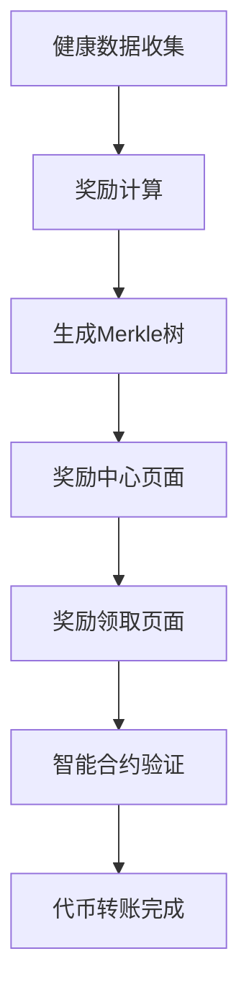

# LUMIEAI 奖励分发系统产品需求文档

## 1. 产品概述

奖励分发系统是LUMIEAI平台的核心激励机制，基于Merkle树技术实现去中心化的LUM代币奖励分发。系统通过生成每周奖励快照，使用智能合约验证用户资格，确保奖励分发的透明性、安全性和可验证性。

该系统解决了传统中心化奖励分发中的信任问题，用户可以通过提供Merkle证明来自主领取属于自己的LUM代币奖励，无需依赖中心化服务器的信任。

## 2. 核心功能

### 2.1 用户角色

| 角色 | 注册方式 | 核心权限 |
|------|----------|----------|
| 普通用户 | 邮箱注册 | 可查看奖励记录，领取每周LUM代币奖励 |
| 系统管理员 | 内部分配 | 可生成奖励快照，管理奖励分发周期 |

### 2.2 功能模块

我们的奖励分发系统包含以下主要页面：
1. **奖励中心页面**：奖励概览、可领取奖励显示、领取历史记录
2. **奖励领取页面**：Merkle证明验证、代币领取操作、交易状态跟踪
3. **奖励管理页面**：管理员生成奖励快照、查看分发统计、系统配置

### 2.3 页面详情

| 页面名称 | 模块名称 | 功能描述 |
|----------|----------|----------|
| 奖励中心页面 | 奖励概览模块 | 显示用户总奖励、本周可领取奖励、历史累计奖励统计 |
| 奖励中心页面 | 可领取奖励模块 | 展示当前可领取的奖励金额，显示奖励来源和计算依据 |
| 奖励中心页面 | 历史记录模块 | 查看历史领取记录，支持按时间和金额筛选 |
| 奖励领取页面 | 证明验证模块 | 验证用户Merkle证明，确认奖励资格和金额 |
| 奖励领取页面 | 代币领取模块 | 执行智能合约调用，完成LUM代币转账到用户钱包 |
| 奖励领取页面 | 状态跟踪模块 | 显示交易哈希、确认状态、Gas费用等交易详情 |
| 奖励管理页面 | 快照生成模块 | 管理员生成每周奖励快照，计算用户奖励并构建Merkle树 |
| 奖励管理页面 | 分发统计模块 | 查看奖励分发统计，包括参与用户数、总奖励金额等 |
| 奖励管理页面 | 系统配置模块 | 配置奖励计算规则、分发周期、最小领取金额等参数 |

## 3. 核心流程

### 3.1 奖励计算流程

系统每周定时计算用户奖励，基于用户的健康数据贡献、任务完成情况等因素。计算完成后生成包含所有用户奖励信息的Merkle树，并将根哈希提交到RewardDistributor智能合约。

### 3.2 奖励领取流程

用户查看可领取奖励后，系统生成对应的Merkle证明。用户确认领取后，前端调用智能合约的claim函数，提供Merkle证明进行验证。验证通过后，合约自动将LUM代币转账到用户钱包。

### 3.3 奖励验证流程

智能合约接收到领取请求后，使用提供的Merkle证明验证用户是否有权领取指定金额的奖励。验证通过且用户未重复领取的情况下，执行代币转账并记录领取状态。

## 4. 用户界面设计

### 4.1 设计风格

- 主色调：金色 (#F59E0B) 和深蓝色 (#1E3A8A)
- 辅助色：绿色 (#10B981) 表示可领取状态，灰色 (#6B7280) 表示已领取
- 按钮样式：渐变背景，圆角设计，带有发光效果
- 字体：系统默认字体，奖励金额使用粗体显示
- 布局风格：卡片式布局，突出奖励信息
- 图标风格：金币、奖杯等奖励主题图标

### 4.2 页面设计概览

| 页面名称 | 模块名称 | UI元素 |
|----------|----------|--------|
| 奖励中心页面 | 奖励概览模块 | 大数字显示总奖励，进度条显示本周进度，金币动画效果 |
| 奖励中心页面 | 可领取奖励模块 | 突出显示可领取金额，领取按钮带有脉冲动画 |
| 奖励领取页面 | 证明验证模块 | 加载动画，验证成功/失败状态图标 |
| 奖励领取页面 | 代币领取模块 | 确认对话框，交易进度指示器，成功庆祝动画 |
| 奖励管理页面 | 快照生成模块 | 生成按钮，进度条，数据统计表格 |

### 4.3 响应式设计

产品采用移动优先的响应式设计，在移动端优化奖励信息的展示和领取操作的便捷性。确保在不同设备上都能清晰显示奖励金额和状态信息。