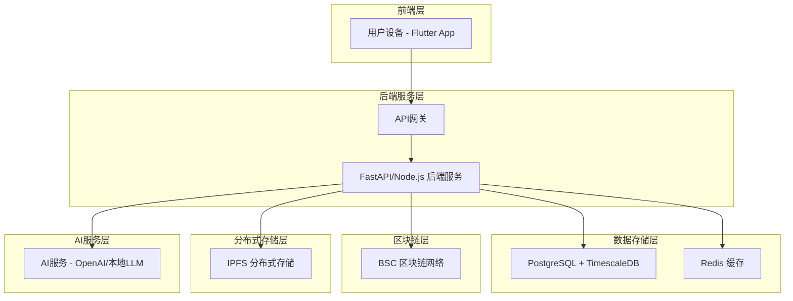
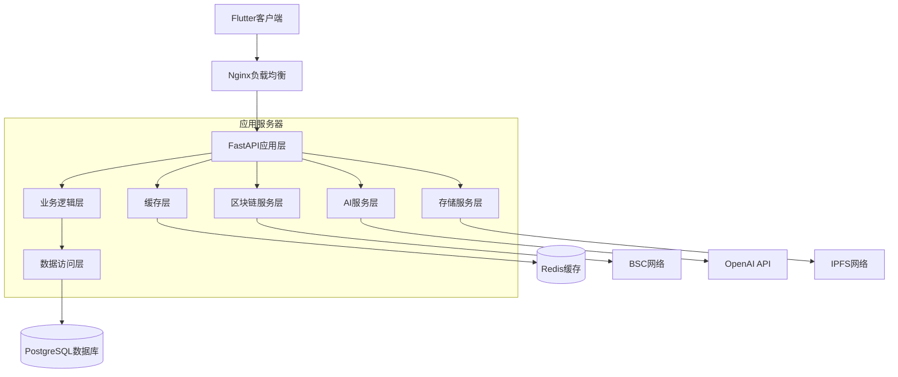
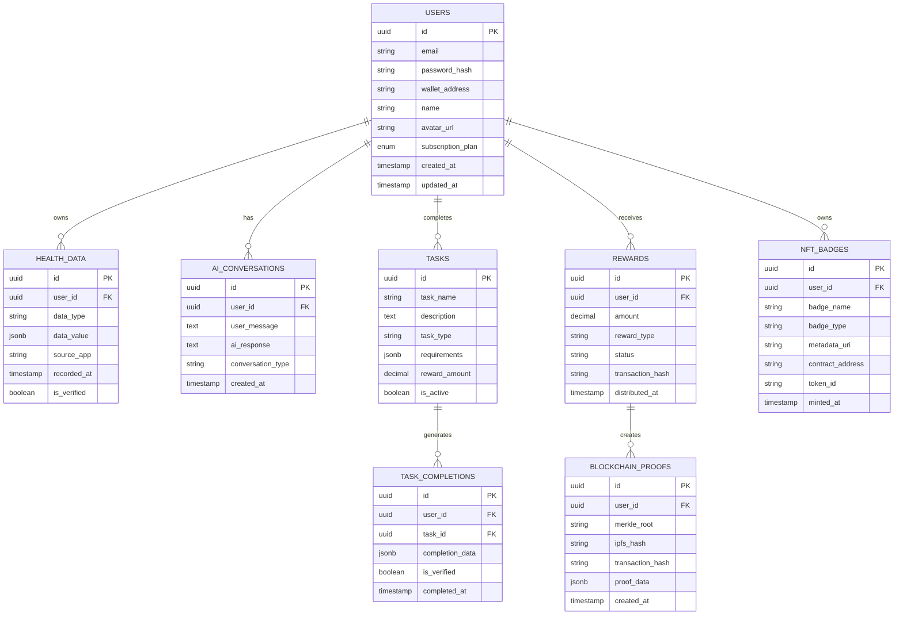

# LUMIEAI 技术架构文档

## 1. 架构设计



## 2. 技术描述

* 前端：Flutter\@3.16 + Provider状态管理 + web3dart区块链集成

* 后端：FastAPI\@0.104 + SQLAlchemy ORM + Celery异步任务

* 数据库：PostgreSQL\@15 + TimescaleDB时序扩展 + Redis\@7缓存

* 区块链：BSC网络 + Web3.py + 智能合约(Solidity)

* 存储：IPFS + Pinata云服务

* AI服务：OpenAI GPT-4 + 本地健康模型

## 3. 路由定义

| 路由           | 用途                  |
| ------------ | ------------------- |
| /login       | 登录页面，支持邮箱和钱包登录      |
| /dashboard   | 仪表盘页面，显示健康数据概览和AI建议 |
| /health-data | 健康数据页面，数据可视化和授权管理   |
| /ai-chat     | AI对话页面，智能健康咨询和计划制定  |
| /tasks       | 任务中心页面，日常任务和挑战管理    |
| /rewards     | 奖励页面，代币奖励和NFT勋章展示   |
| /marketplace | 商城页面，健康产品浏览和LUM支付   |
| /profile     | 个人中心页面，用户设置和数据确权    |
| /settings    | 设置页面，主题切换和隐私配置      |

## 4. API定义

### 4.1 核心API

用户认证相关

```
POST /api/auth/login
```

请求参数:

| 参数名             | 参数类型   | 是否必需  | 描述                 |
| --------------- | ------ | ----- | ------------------ |
| email           | string | false | 邮箱地址(邮箱登录时必需)      |
| password        | string | false | 密码(邮箱登录时必需)        |
| wallet\_address | string | false | 钱包地址(钱包登录时必需)      |
| signature       | string | false | 钱包签名(钱包登录时必需)      |
| login\_type     | string | true  | 登录类型: email/wallet |

响应参数:

| 参数名             | 参数类型    | 描述      |
| --------------- | ------- | ------- |
| success         | boolean | 登录是否成功  |
| access\_token   | string  | JWT访问令牌 |
| user\_id        | string  | 用户唯一标识  |
| wallet\_address | string  | 用户钱包地址  |

健康数据管理

```
GET /api/health/data
POST /api/health/sync
```

AI对话服务

```
POST /api/ai/chat
GET /api/ai/plan/{user_id}
```

区块链交互

```
POST /api/blockchain/proof
GET /api/blockchain/rewards/{user_id}
```

## 5. 服务器架构图



## 6. 数据模型

### 6.1 数据模型定义



### 6.2 数据定义语言

用户表 (users)

```sql
-- 创建用户表
CREATE TABLE users (
    id UUID PRIMARY KEY DEFAULT gen_random_uuid(),
    email VARCHAR(255) UNIQUE,
    password_hash VARCHAR(255),
    wallet_address VARCHAR(42) UNIQUE,
    name VARCHAR(100) NOT NULL,
    avatar_url TEXT,
    subscription_plan VARCHAR(20) DEFAULT 'free' CHECK (subscription_plan IN ('free', 'premium')),
    created_at TIMESTAMP WITH TIME ZONE DEFAULT NOW(),
    updated_at TIMESTAMP WITH TIME ZONE DEFAULT NOW()
);

-- 创建索引
CREATE INDEX idx_users_email ON users(email);
CREATE INDEX idx_users_wallet ON users(wallet_address);
```

健康数据表 (health\_data)

```sql
-- 创建健康数据表(使用TimescaleDB)
CREATE TABLE health_data (
    id UUID PRIMARY KEY DEFAULT gen_random_uuid(),
    user_id UUID NOT NULL REFERENCES users(id),
    data_type VARCHAR(50) NOT NULL,
    data_value JSONB NOT NULL,
    source_app VARCHAR(100),
    recorded_at TIMESTAMP WITH TIME ZONE NOT NULL,
    is_verified BOOLEAN DEFAULT false,
    created_at TIMESTAMP WITH TIME ZONE DEFAULT NOW()
);

-- 转换为时序表
SELECT create_hypertable('health_data', 'recorded_at');

-- 创建索引
CREATE INDEX idx_health_data_user_id ON health_data(user_id);
CREATE INDEX idx_health_data_type ON health_data(data_type);
CREATE INDEX idx_health_data_recorded_at ON health_data(recorded_at DESC);
```

AI对话表 (ai\_conversations)

```sql
CREATE TABLE ai_conversations (
    id UUID PRIMARY KEY DEFAULT gen_random_uuid(),
    user_id UUID NOT NULL REFERENCES users(id),
    user_message TEXT NOT NULL,
    ai_response TEXT NOT NULL,
    conversation_type VARCHAR(50) DEFAULT 'general',
    created_at TIMESTAMP WITH TIME ZONE DEFAULT NOW()
);

CREATE INDEX idx_ai_conversations_user_id ON ai_conversations(user_id);
CREATE INDEX idx_ai_conversations_created_at ON ai_conversations(created_at DESC);
```

任务表 (tasks)

```sql
CREATE TABLE tasks (
    id UUID PRIMARY KEY DEFAULT gen_random_uuid(),
    task_name VARCHAR(200) NOT NULL,
    description TEXT,
    task_type VARCHAR(50) NOT NULL,
    requirements JSONB,
    reward_amount DECIMAL(18,8) DEFAULT 0,
    is_active BOOLEAN DEFAULT true,
    created_at TIMESTAMP WITH TIME ZONE DEFAULT NOW()
);

-- 初始化基础任务数据
INSERT INTO tasks (task_name, description, task_type, requirements, reward_amount) VALUES
('每日步数达标', '每日步数达到8000步', 'daily_steps', '{"target_steps": 8000}', 10.0),
('睡眠质量记录', '记录每日睡眠时长和质量', 'sleep_tracking', '{"min_hours": 7}', 5.0),
('健康数据同步', '同步第三方健康应用数据', 'data_sync', '{}', 2.0);
```

区块链证明表 (blockchain\_proofs)

```sql
CREATE TABLE blockchain_proofs (
    id UUID PRIMARY KEY DEFAULT gen_random_uuid(),
    user_id UUID NOT NULL REFERENCES users(id),
    merkle_root VARCHAR(66) NOT NULL,
    ipfs_hash VARCHAR(100) NOT NULL,
    transaction_hash VARCHAR(66),
    proof_data JSONB NOT NULL,
    created_at TIMESTAMP WITH TIME ZONE DEFAULT NOW()
);

CREATE INDEX idx_blockchain_proofs_user_id ON blockchain_proofs(user_id);
CREATE INDEX idx_blockchain_proofs_merkle_root ON blockchain_proofs(merkle_root);
```

