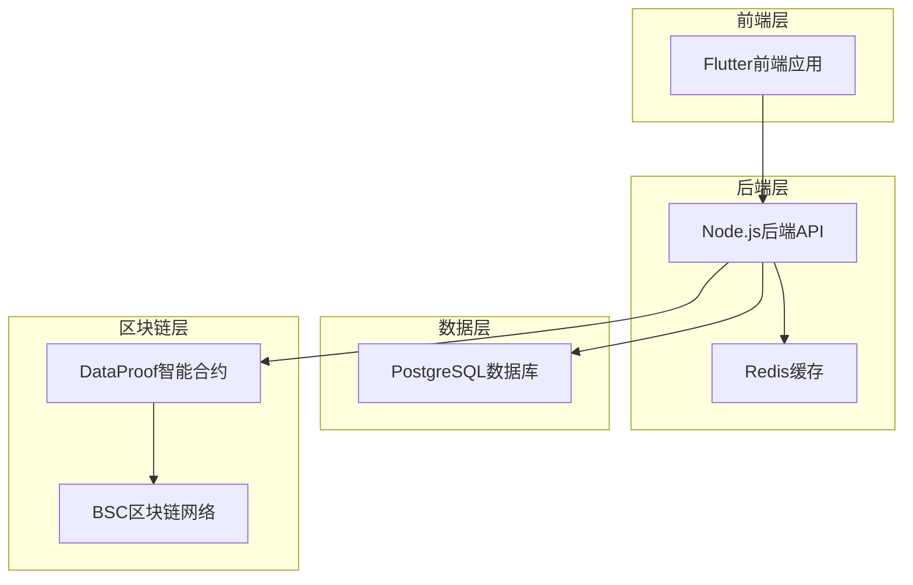
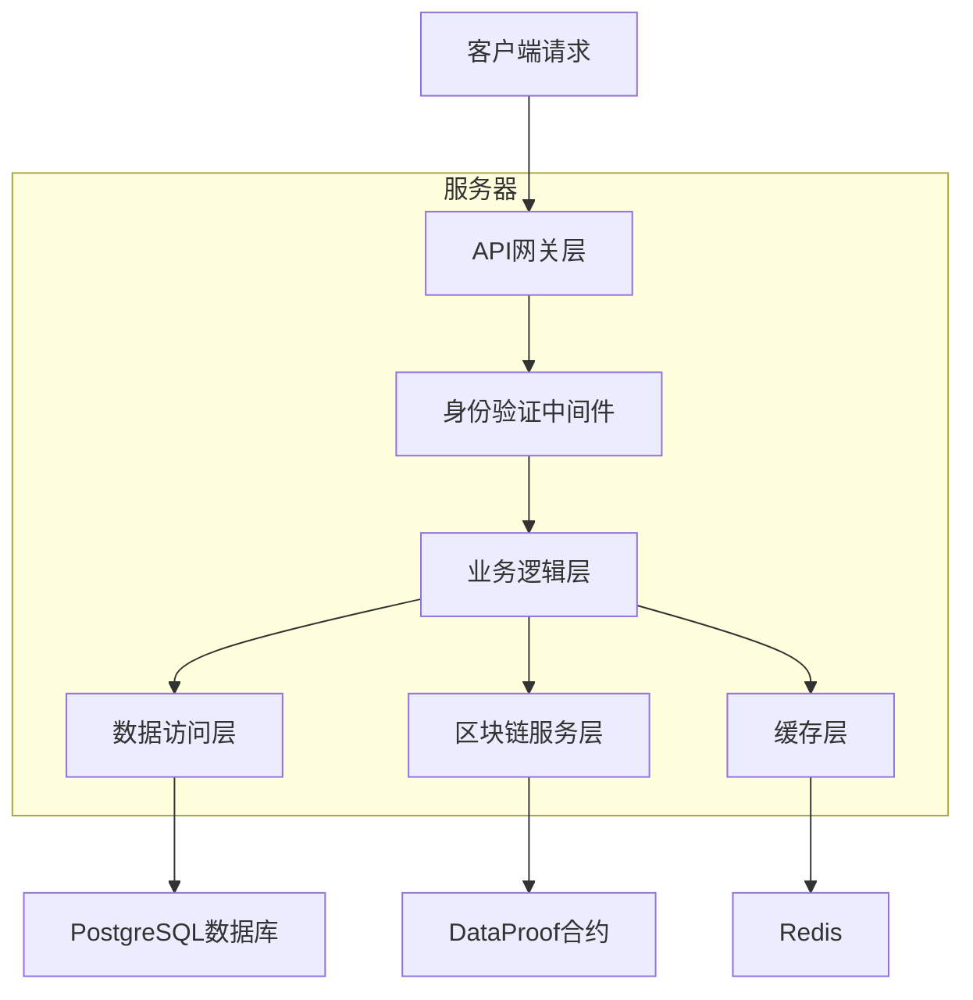
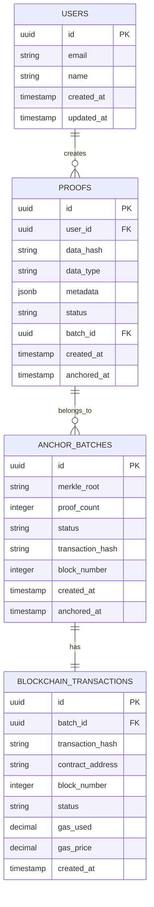

# LUMIEAI 数据证明系统技术架构文档

## 1. 架构设计



## 2. 技术描述

* 前端：Flutter\@3.16 + Provider状态管理 + web3dart区块链交互

* 后端：Node.js\@20 + Express\@4 + TypeScript

* 数据库：PostgreSQL\@15（主数据库）+ Redis\@7（缓存）

* 区块链：Solidity\@0.8.19 + Hardhat开发框架 + BSC Testnet

* 部署：Docker容器化 + Vercel前端部署

## 3. 路由定义

| 路由             | 用途                     |
| -------------- | ---------------------- |
| /proofs        | 数据存证主页面，显示存证状态和历史记录    |
| /proofs/submit | 数据提交页面，用户手动提交健康数据存证    |
| /proofs/verify | 数据验证页面，验证存证真实性和查看区块链链接 |
| /proofs/anchor | 锚定管理页面，管理员执行批量锚定操作     |

## 4. API定义

### 4.1 核心API

#### 每日数据提交

```
POST /api/proofs/daily/commit
```

请求参数：

| 参数名       | 参数类型   | 是否必需  | 描述                           |
| --------- | ------ | ----- | ---------------------------- |
| userId    | string | true  | 用户ID                         |
| dataHash  | string | true  | 健康数据哈希值                      |
| dataType  | string | true  | 数据类型（steps/heartRate/sleep等） |
| timestamp | number | true  | 数据时间戳                        |
| metadata  | object | false | 数据元信息                        |

响应参数：

| 参数名     | 参数类型    | 描述                      |
| ------- | ------- | ----------------------- |
| success | boolean | 提交是否成功                  |
| proofId | string  | 存证记录ID                  |
| status  | string  | 存证状态（pending/committed） |

请求示例：

```json
{
  "userId": "user123",
  "dataHash": "0x1234567890abcdef",
  "dataType": "daily_summary",
  "timestamp": 1703980800,
  "metadata": {
    "steps": 8500,
    "heartRate": 72,
    "sleepHours": 7.5
  }
}
```

#### 批量锚定到区块链

```
POST /api/proofs/batch/anchor
```

请求参数：

| 参数名       | 参数类型      | 是否必需  | 描述         |
| --------- | --------- | ----- | ---------- |
| proofIds  | string\[] | true  | 待锚定的存证ID列表 |
| batchSize | number    | false | 批量大小，默认100 |

响应参数：

| 参数名             | 参数类型    | 描述         |
| --------------- | ------- | ---------- |
| success         | boolean | 锚定是否成功     |
| transactionHash | string  | 区块链交易哈希    |
| merkleRoot      | string  | Merkle树根哈希 |
| anchoredCount   | number  | 成功锚定的记录数   |

#### 验证数据存证

```
GET /api/proofs/verify/:dataHash
```

响应参数：

| 参数名             | 参数类型      | 描述         |
| --------------- | --------- | ---------- |
| exists          | boolean   | 存证是否存在     |
| proofId         | string    | 存证记录ID     |
| timestamp       | number    | 存证时间戳      |
| transactionHash | string    | 区块链交易哈希    |
| blockNumber     | number    | 区块高度       |
| merkleProof     | string\[] | Merkle证明路径 |

#### 获取存证历史

```
GET /api/proofs/history
```

请求参数：

| 参数名    | 参数类型   | 是否必需  | 描述                               |
| ------ | ------ | ----- | -------------------------------- |
| userId | string | true  | 用户ID                             |
| page   | number | false | 页码，默认1                           |
| limit  | number | false | 每页数量，默认20                        |
| status | string | false | 状态筛选（pending/committed/anchored） |

## 5. 服务器架构图



## 6. 数据模型

### 6.1 数据模型定义



### 6.2 数据定义语言

#### 用户表 (users)

```sql
-- 创建用户表
CREATE TABLE users (
    id UUID PRIMARY KEY DEFAULT gen_random_uuid(),
    email VARCHAR(255) UNIQUE NOT NULL,
    name VARCHAR(100) NOT NULL,
    created_at TIMESTAMP WITH TIME ZONE DEFAULT NOW(),
    updated_at TIMESTAMP WITH TIME ZONE DEFAULT NOW()
);

-- 创建索引
CREATE INDEX idx_users_email ON users(email);
```

#### 存证记录表 (proofs)

```sql
-- 创建存证记录表
CREATE TABLE proofs (
    id UUID PRIMARY KEY DEFAULT gen_random_uuid(),
    user_id UUID NOT NULL REFERENCES users(id),
    data_hash VARCHAR(66) NOT NULL, -- 0x + 64位哈希
    data_type VARCHAR(50) NOT NULL,
    metadata JSONB,
    status VARCHAR(20) DEFAULT 'pending' CHECK (status IN ('pending', 'committed', 'anchored')),
    batch_id UUID REFERENCES anchor_batches(id),
    created_at TIMESTAMP WITH TIME ZONE DEFAULT NOW(),
    anchored_at TIMESTAMP WITH TIME ZONE
);

-- 创建索引
CREATE INDEX idx_proofs_user_id ON proofs(user_id);
CREATE INDEX idx_proofs_data_hash ON proofs(data_hash);
CREATE INDEX idx_proofs_status ON proofs(status);
CREATE INDEX idx_proofs_created_at ON proofs(created_at DESC);
```

#### 锚定批次表 (anchor\_batches)

```sql
-- 创建锚定批次表
CREATE TABLE anchor_batches (
    id UUID PRIMARY KEY DEFAULT gen_random_uuid(),
    merkle_root VARCHAR(66) NOT NULL,
    proof_count INTEGER NOT NULL,
    status VARCHAR(20) DEFAULT 'pending' CHECK (status IN ('pending', 'processing', 'completed', 'failed')),
    transaction_hash VARCHAR(66),
    block_number BIGINT,
    created_at TIMESTAMP WITH TIME ZONE DEFAULT NOW(),
    anchored_at TIMESTAMP WITH TIME ZONE
);

-- 创建索引
CREATE INDEX idx_anchor_batches_status ON anchor_batches(status);
CREATE INDEX idx_anchor_batches_transaction_hash ON anchor_batches(transaction_hash);
```

#### 区块链交易表 (blockchain\_transactions)

```sql
-- 创建区块链交易表
CREATE TABLE blockchain_transactions (
    id UUID PRIMARY KEY DEFAULT gen_random_uuid(),
    batch_id UUID NOT NULL REFERENCES anchor_batches(id),
    transaction_hash VARCHAR(66) NOT NULL,
    contract_address VARCHAR(42) NOT NULL,
    block_number BIGINT,
    status VARCHAR(20) DEFAULT 'pending' CHECK (status IN ('pending', 'confirmed', 'failed')),
    gas_used DECIMAL(20, 0),
    gas_price DECIMAL(30, 0),
    created_at TIMESTAMP WITH TIME ZONE DEFAULT NOW()
);

-- 创建索引
CREATE INDEX idx_blockchain_transactions_batch_id ON blockchain_transactions(batch_id);
CREATE INDEX idx_blockchain_transactions_hash ON blockchain_transactions(transaction_hash);
```

#### 初始化数据

```sql
-- 插入测试用户
INSERT INTO users (email, name) VALUES 
('admin@lumieai.com', '系统管理员'),
('test@lumieai.com', '测试用户');

-- 插入示例存证记录
INSERT INTO proofs (user_id, data_hash, data_type, metadata) 
SELECT 
    u.id,
    '0x' || encode(sha256(random()::text::bytea), 'hex'),
    'daily_summary',
    jsonb_build_object(
        'steps', (random() * 10000 + 5000)::int,
        'heartRate', (random() * 40 + 60)::int,
        'sleepHours', (random() * 4 + 6)::decimal(3,1)
    )
FROM users u, generate_series(1, 10);
```

## 7. DataProof智能合约

### 7.1 合约接口定义

```solidity
// SPDX-License-Identifier: MIT
pragma solidity ^0.8.19;

contract DataProof {
    struct ProofRecord {
        bytes32 merkleRoot;
        uint256 timestamp;
        uint256 blockNumber;
        address submitter;
        uint256 proofCount;
    }
    
    mapping(bytes32 => ProofRecord) public proofs;
    mapping(address => bool) public authorizedSubmitters;
    
    event ProofAnchored(
        bytes32 indexed merkleRoot,
        uint256 timestamp,
        uint256 proofCount,
        address submitter
    );
    
    function anchorProof(
        bytes32 _merkleRoot,
        uint256 _proofCount
    ) external;
    
    function verifyProof(
        bytes32 _merkleRoot
    ) external view returns (ProofRecord memory);
    
    function addAuthorizedSubmitter(address _submitter) external;
    
    function removeAuthorizedSubmitter(address _submitter) external;
}
```

### 7.2 合约部署配置

```javascript
// hardhat.config.js
module.exports = {
  solidity: "0.8.19",
  networks: {
    bscTestnet: {
      url: "https://data-seed-prebsc-1-s1.binance.org:8545/",
      chainId: 97,
      accounts: [process.env.PRIVATE_KEY]
    }
  },
  etherscan: {
    apiKey: process.env.BSCSCAN_API_KEY
  }
};
```

