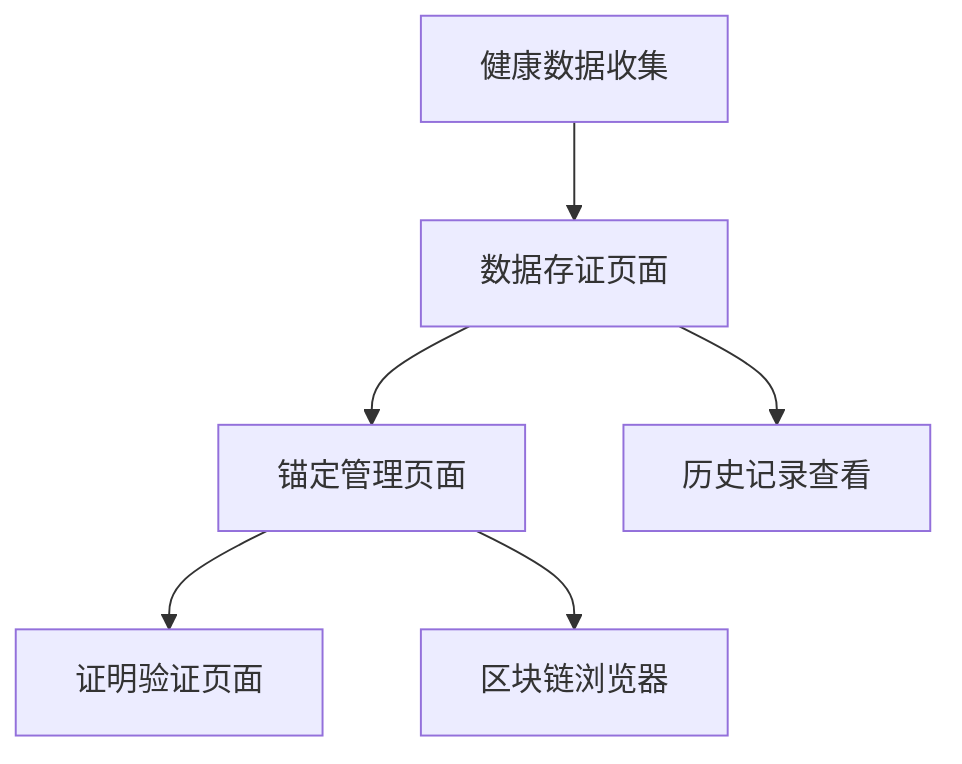

# LUMIEAI 数据证明系统产品需求文档

## 1. 产品概述

数据证明系统是LUMIEAI平台的核心功能之一，旨在将用户的健康数据安全地存储到区块链上，确保数据的不可篡改性和可验证性。系统通过智能合约技术实现数据存证，为用户提供可信的健康数据证明服务。

该系统解决了传统健康数据存储中的信任问题，通过区块链技术确保数据的真实性和完整性，为用户建立可信的健康档案。

## 2. 核心功能

### 2.1 用户角色

| 角色 | 注册方式 | 核心权限 |
|------|----------|----------|
| 普通用户 | 邮箱注册 | 可提交个人健康数据，查看自己的存证记录 |
| 系统管理员 | 内部分配 | 可管理批量锚定操作，监控系统状态 |

### 2.2 功能模块

我们的数据证明系统包含以下主要页面：
1. **数据存证页面**：健康数据提交、存证状态显示、历史记录查看
2. **锚定管理页面**：批量锚定操作、区块链交易状态、锚定历史
3. **证明验证页面**：数据证明验证、区块链链接查看、证明书下载

### 2.3 页面详情

| 页面名称 | 模块名称 | 功能描述 |
|----------|----------|----------|
| 数据存证页面 | 数据提交模块 | 提交每日健康数据，生成数据哈希，创建存证记录 |
| 数据存证页面 | 状态显示模块 | 显示数据存证状态（待提交、已提交、已锚定），展示存证时间戳 |
| 数据存证页面 | 历史记录模块 | 查看历史存证记录，支持按时间筛选和搜索 |
| 锚定管理页面 | 批量锚定模块 | 执行批量数据锚定到区块链，显示锚定进度和状态 |
| 锚定管理页面 | 交易状态模块 | 显示区块链交易哈希，交易确认状态，Gas费用信息 |
| 锚定管理页面 | 锚定历史模块 | 查看历史锚定记录，统计锚定数据量和成功率 |
| 证明验证页面 | 验证模块 | 输入数据哈希验证存证真实性，显示验证结果 |
| 证明验证页面 | 链接查看模块 | 提供区块链浏览器链接，查看链上交易详情 |
| 证明验证页面 | 证明下载模块 | 生成并下载数据证明书，包含二维码和数字签名 |

## 3. 核心流程

### 3.1 数据存证流程

用户每日健康数据收集完成后，系统自动生成数据摘要并提交到后端存证服务。后端验证数据完整性后，将数据哈希存储到本地数据库，并标记为待锚定状态。

### 3.2 批量锚定流程

系统定期（如每日凌晨）执行批量锚定操作，将累积的数据哈希通过Merkle树结构组织，并将根哈希提交到DataProof智能合约。合约执行成功后，更新本地记录状态为已锚定。

### 3.3 数据验证流程

用户或第三方可通过数据哈希查询存证记录，系统返回存证时间、区块链交易哈希等信息。验证者可通过区块链浏览器确认数据的真实性和时间戳。

## 4. 用户界面设计

### 4.1 设计风格

- 主色调：深蓝色 (#1E3A8A) 和浅蓝色 (#3B82F6)
- 辅助色：绿色 (#10B981) 表示成功状态，橙色 (#F59E0B) 表示处理中
- 按钮样式：圆角矩形，带有轻微阴影效果
- 字体：系统默认字体，标题使用16-18px，正文使用14px
- 布局风格：卡片式布局，顶部导航栏
- 图标风格：线性图标，配合区块链和安全主题

### 4.2 页面设计概览

| 页面名称 | 模块名称 | UI元素 |
|----------|----------|--------|
| 数据存证页面 | 数据提交模块 | 数据摘要卡片，提交按钮，状态指示器，进度条动画 |
| 数据存证页面 | 状态显示模块 | 状态标签（待提交/已提交/已锚定），时间戳显示，图标指示 |
| 锚定管理页面 | 批量锚定模块 | 锚定按钮，进度条，数据统计卡片，操作日志 |
| 锚定管理页面 | 交易状态模块 | 交易哈希链接，确认状态图标，Gas费用显示 |
| 证明验证页面 | 验证模块 | 输入框，验证按钮，结果显示区域，二维码展示 |

### 4.3 响应式设计

产品采用移动优先的响应式设计，支持桌面端和移动端访问。在移动端优化触摸交互，确保按钮大小适合手指操作。