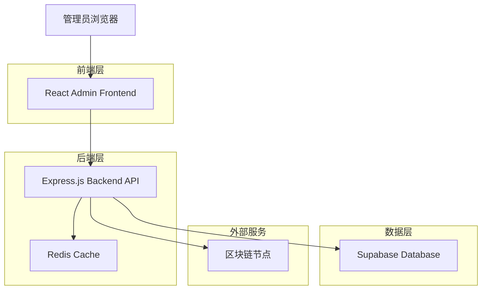
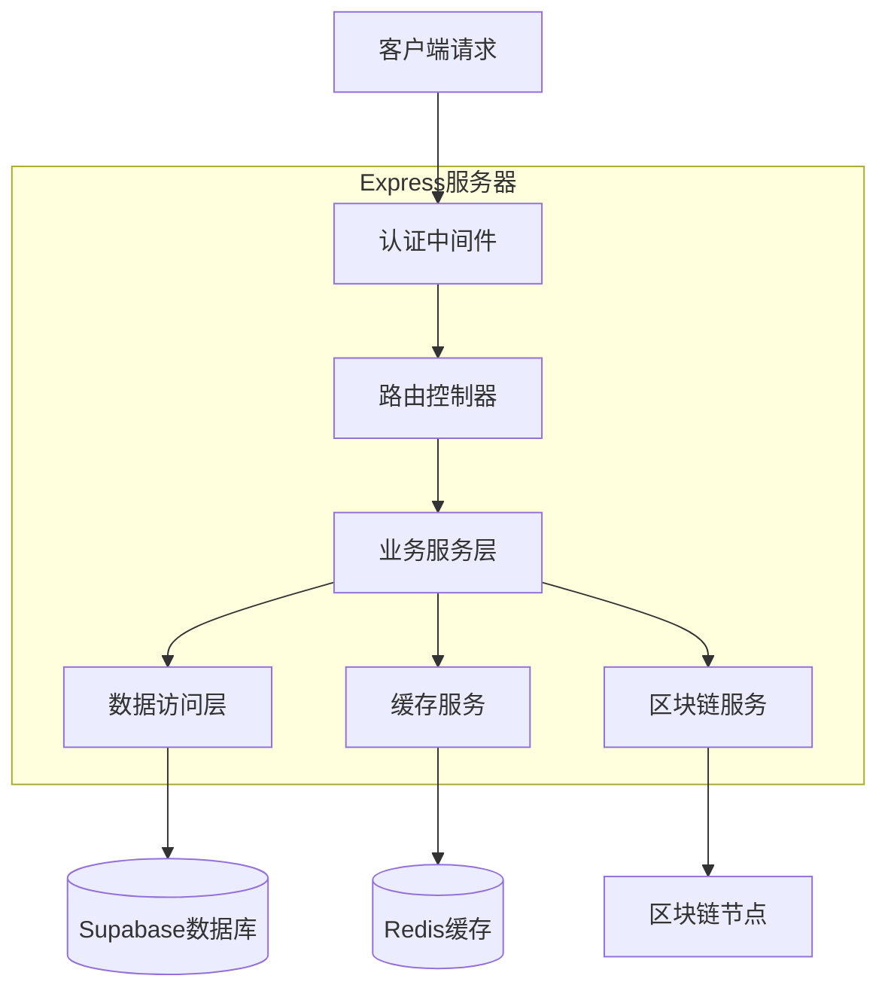
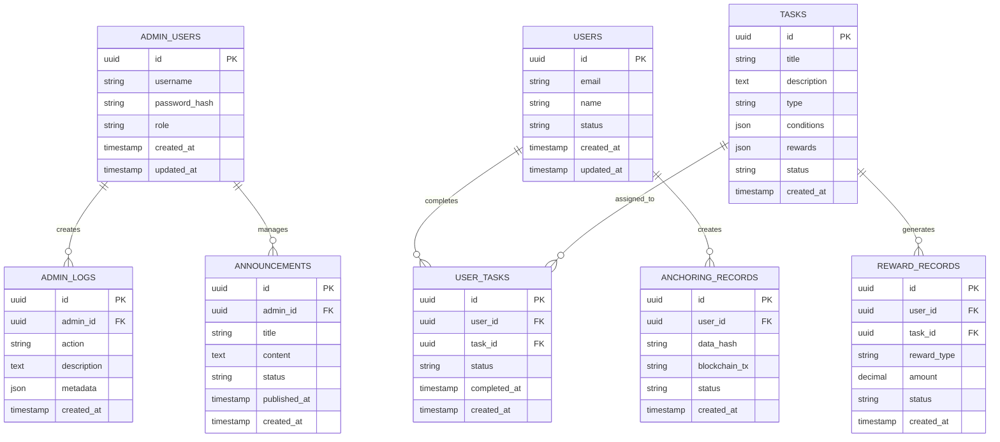

# LUMIEAI 管理后台系统技术架构文档

## 1. 架构设计



## 2. 技术描述

* 前端：React\@18 + TypeScript + Ant Design + React Router + Zustand

* 后端：Express\@4 + TypeScript + JWT认证

* 数据库：Supabase (PostgreSQL)

* 缓存：Redis

* 外部服务：区块链节点API

## 3. 路由定义

| 路由                   | 用途               |
| -------------------- | ---------------- |
| /admin/login         | 管理员登录页面          |
| /admin/dashboard     | 仪表盘，显示关键数据和统计信息  |
| /admin/users         | 用户管理页面，用户列表和详情   |
| /admin/users/:id     | 用户详情页面，查看和编辑用户信息 |
| /admin/anchoring     | 锚定记录页面，数据锚定历史查询  |
| /admin/tasks         | 任务与奖励管理页面        |
| /admin/announcements | 公告管理页面，发布和管理公告   |
| /admin/reports       | 报告系统页面，数据分析和导出   |
| /admin/settings      | 系统设置页面，配置和维护工具   |

## 4. API定义

### 4.1 核心API

**管理员认证相关**

```
POST /api/admin/auth/login
```

请求参数：

| 参数名      | 参数类型   | 是否必需 | 描述     |
| -------- | ------ | ---- | ------ |
| username | string | true | 管理员用户名 |
| password | string | true | 密码     |
| captcha  | string | true | 验证码    |

响应参数：

| 参数名     | 参数类型    | 描述      |
| ------- | ------- | ------- |
| success | boolean | 登录是否成功  |
| token   | string  | JWT访问令牌 |
| user    | object  | 管理员用户信息 |

**仪表盘数据**

```
GET /api/admin/dashboard/stats
```

响应参数：

| 参数名               | 参数类型   | 描述    |
| ----------------- | ------ | ----- |
| totalUsers        | number | 总用户数  |
| activeUsers       | number | 活跃用户数 |
| totalTransactions | number | 总交易数  |
| totalRevenue      | number | 总收入   |
| anchoringCount    | number | 锚定记录数 |

**用户管理**

```
GET /api/admin/users
GET /api/admin/users/:id
PUT /api/admin/users/:id
DELETE /api/admin/users/:id
```

**锚定记录**

```
GET /api/admin/anchoring
GET /api/admin/anchoring/:id
POST /api/admin/anchoring/verify
```

**任务与奖励**

```
GET /api/admin/tasks
POST /api/admin/tasks
PUT /api/admin/tasks/:id
DELETE /api/admin/tasks/:id
GET /api/admin/rewards/records
```

**公告管理**

```
GET /api/admin/announcements
POST /api/admin/announcements
PUT /api/admin/announcements/:id
DELETE /api/admin/announcements/:id
```

**报告系统**

```
GET /api/admin/reports/generate
POST /api/admin/reports/export
GET /api/admin/reports/analytics
```

**系统设置**

```
GET /api/admin/settings
PUT /api/admin/settings
GET /api/admin/logs
POST /api/admin/maintenance
```

## 5. 服务器架构图



## 6. 数据模型

### 6.1 数据模型定义



### 6.2 数据定义语言

**管理员用户表 (admin\_users)**

```sql
-- 创建表
CREATE TABLE admin_users (
    id UUID PRIMARY KEY DEFAULT gen_random_uuid(),
    username VARCHAR(50) UNIQUE NOT NULL,
    password_hash VARCHAR(255) NOT NULL,
    role VARCHAR(20) DEFAULT 'admin' CHECK (role IN ('super_admin', 'admin', 'analyst')),
    email VARCHAR(255),
    last_login TIMESTAMP WITH TIME ZONE,
    status VARCHAR(20) DEFAULT 'active' CHECK (status IN ('active', 'inactive', 'suspended')),
    created_at TIMESTAMP WITH TIME ZONE DEFAULT NOW(),
    updated_at TIMESTAMP WITH TIME ZONE DEFAULT NOW()
);

-- 创建索引
CREATE INDEX idx_admin_users_username ON admin_users(username);
CREATE INDEX idx_admin_users_role ON admin_users(role);

-- 初始化数据
INSERT INTO admin_users (username, password_hash, role, email) VALUES
('superadmin', '$2b$10$hash_here', 'super_admin', 'admin@lumieai.com'),
('admin', '$2b$10$hash_here', 'admin', 'admin2@lumieai.com');
```

**锚定记录表 (anchoring\_records)**

```sql
-- 创建表
CREATE TABLE anchoring_records (
    id UUID PRIMARY KEY DEFAULT gen_random_uuid(),
    user_id UUID REFERENCES users(id),
    data_hash VARCHAR(64) NOT NULL,
    blockchain_tx VARCHAR(66),
    status VARCHAR(20) DEFAULT 'pending' CHECK (status IN ('pending', 'confirmed', 'failed')),
    gas_fee DECIMAL(18, 8),
    block_number BIGINT,
    metadata JSONB,
    created_at TIMESTAMP WITH TIME ZONE DEFAULT NOW(),
    updated_at TIMESTAMP WITH TIME ZONE DEFAULT NOW()
);

-- 创建索引
CREATE INDEX idx_anchoring_records_user_id ON anchoring_records(user_id);
CREATE INDEX idx_anchoring_records_status ON anchoring_records(status);
CREATE INDEX idx_anchoring_records_created_at ON anchoring_records(created_at DESC);
```

**任务表 (tasks)**

```sql
-- 创建表
CREATE TABLE tasks (
    id UUID PRIMARY KEY DEFAULT gen_random_uuid(),
    title VARCHAR(200) NOT NULL,
    description TEXT,
    type VARCHAR(50) NOT NULL,
    conditions JSONB NOT NULL,
    rewards JSONB NOT NULL,
    status VARCHAR(20) DEFAULT 'active' CHECK (status IN ('active', 'inactive', 'completed')),
    start_date TIMESTAMP WITH TIME ZONE,
    end_date TIMESTAMP WITH TIME ZONE,
    created_at TIMESTAMP WITH TIME ZONE DEFAULT NOW(),
    updated_at TIMESTAMP WITH TIME ZONE DEFAULT NOW()
);

-- 创建索引
CREATE INDEX idx_tasks_status ON tasks(status);
CREATE INDEX idx_tasks_type ON tasks(type);
```

**公告表 (announcements)**

```sql
-- 创建表
CREATE TABLE announcements (
    id UUID PRIMARY KEY DEFAULT gen_random_uuid(),
    admin_id UUID REFERENCES admin_users(id),
    title VARCHAR(200) NOT NULL,
    content TEXT NOT NULL,
    status VARCHAR(20) DEFAULT 'draft' CHECK (status IN ('draft', 'published', 'archived')),
    target_audience JSONB,
    published_at TIMESTAMP WITH TIME ZONE,
    created_at TIMESTAMP WITH TIME ZONE DEFAULT NOW(),
    updated_at TIMESTAMP WITH TIME ZONE DEFAULT NOW()
);

-- 创建索引
CREATE INDEX idx_announcements_status ON announcements(status);
CREATE INDEX idx_announcements_published_at ON announcements(published_at DESC);
```

**管理员操作日志表 (admin\_logs)**

```sql
-- 创建表
CREATE TABLE admin_logs (
    id UUID PRIMARY KEY DEFAULT gen_random_uuid(),
    admin_id UUID REFERENCES admin_users(id),
    action VARCHAR(100) NOT NULL,
    description TEXT,
    target_type VARCHAR(50),
    target_id UUID,
    metadata JSONB,
    ip_address INET,
    user_agent TEXT,
    created_at TIMESTAMP WITH TIME ZONE DEFAULT NOW()
);

-- 创建索引
CREATE INDEX idx_admin_logs_admin_id ON admin_logs(admin_id);
CREATE INDEX idx_admin_logs_action ON admin_logs(action);
CREATE INDEX idx_admin_logs_created_at ON admin_logs(created_at DESC);
```

**权限设置**

```sql
-- 为anon角色授予基本权限
GRANT SELECT ON admin_users TO anon;
GRANT SELECT ON anchoring_records TO anon;
GRANT SELECT ON tasks TO anon;
GRANT SELECT ON announcements TO anon;

-- 为authenticated角色授予完整权限
GRANT ALL PRIVILEGES ON admin_users TO authenticated;
GRANT ALL PRIVILEGES ON anchoring_records TO authenticated;
GRANT ALL PRIVILEGES ON tasks TO authenticated;
GRANT ALL PRIVILEGES ON user_tasks TO authenticated;
GRANT ALL PRIVILEGES ON reward_records TO authenticated;
GRANT ALL PRIVILEGES ON announcements TO authenticated;
GRANT ALL PRIVILEGES ON admin_logs TO authenticated;
```

