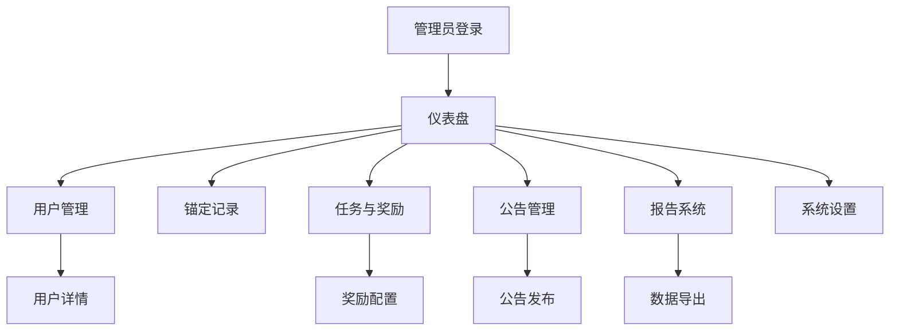

# LUMIEAI 管理后台系统需求文档

## 1. 产品概述

LUMIEAI管理后台系统是为平台管理员和运营人员设计的综合管理平台，提供数据监控、用户管理、内容管理、系统配置等核心功能。
- 系统旨在提高运营效率，简化管理流程，为管理员提供全面的数据洞察和操作工具。
- 目标是构建一个安全、高效、易用的管理后台，支撑LUMIEAI平台的日常运营和长期发展。

## 2. 核心功能

### 2.1 用户角色

| 角色 | 注册方式 | 核心权限 |
|------|----------|----------|
| 超级管理员 | 系统预设账号 | 拥有所有功能权限，包括用户管理、系统设置、数据导出等 |
| 运营管理员 | 超级管理员邀请 | 用户管理、内容管理、数据查看，不包括系统核心设置 |
| 数据分析师 | 管理员邀请 | 仅可查看报告、导出数据，无编辑权限 |

### 2.2 功能模块

我们的管理后台系统包含以下主要页面：
1. **仪表盘页面**：数据概览、实时统计、关键指标展示。
2. **用户管理页面**：用户列表、详情查看、权限管理、状态控制。
3. **锚定记录页面**：数据锚定历史、验证状态、区块链记录查询。
4. **任务与奖励页面**：任务配置、奖励设置、发放记录管理。
5. **公告管理页面**：公告发布、编辑、状态管理、推送设置。
6. **报告系统页面**：数据报告生成、导出功能、统计分析。
7. **系统设置页面**：配置管理、参数设置、系统维护工具。

### 2.3 页面详情

| 页面名称 | 模块名称 | 功能描述 |
|----------|----------|----------|
| 仪表盘页面 | 数据概览 | 显示平台关键指标：用户数量、交易额、活跃度等实时数据 |
| 仪表盘页面 | 统计图表 | 提供趋势图、饼图、柱状图等多种数据可视化展示 |
| 仪表盘页面 | 快捷操作 | 常用功能快速入口，如发布公告、查看异常等 |
| 用户管理页面 | 用户列表 | 分页展示用户信息，支持搜索、筛选、排序功能 |
| 用户管理页面 | 用户详情 | 查看用户完整信息、交易记录、行为轨迹 |
| 用户管理页面 | 权限管理 | 设置用户角色、权限分配、账号状态控制 |
| 锚定记录页面 | 记录查询 | 按时间、用户、状态等条件查询锚定记录 |
| 锚定记录页面 | 验证状态 | 显示数据验证进度、成功率、失败原因 |
| 锚定记录页面 | 区块链追踪 | 查看区块链交易哈希、确认状态、Gas费用 |
| 任务与奖励页面 | 任务管理 | 创建、编辑、删除任务，设置任务条件和奖励 |
| 任务与奖励页面 | 奖励配置 | 设置奖励类型、数量、发放规则 |
| 任务与奖励页面 | 发放记录 | 查看奖励发放历史、统计数据、异常处理 |
| 公告管理页面 | 公告编辑 | 富文本编辑器创建公告，支持图片、链接等 |
| 公告管理页面 | 发布管理 | 设置发布时间、目标用户、推送渠道 |
| 公告管理页面 | 状态跟踪 | 查看公告阅读量、用户反馈、效果分析 |
| 报告系统页面 | 报告生成 | 自定义时间范围、指标维度生成数据报告 |
| 报告系统页面 | 数据导出 | 支持Excel、CSV、PDF等格式导出 |
| 报告系统页面 | 统计分析 | 提供同比、环比分析，趋势预测功能 |
| 系统设置页面 | 配置管理 | 系统参数配置、功能开关、限制设置 |
| 系统设置页面 | 日志管理 | 查看系统日志、操作记录、错误追踪 |
| 系统设置页面 | 维护工具 | 数据备份、缓存清理、性能监控 |

## 3. 核心流程

### 管理员登录流程
管理员通过专用登录页面输入账号密码，系统验证身份后根据角色权限跳转到相应的仪表盘页面。支持双因素认证确保账号安全。

### 用户管理流程
管理员在用户管理页面查看用户列表，可以搜索特定用户，查看详细信息，根据需要调整用户权限或状态。对于异常用户可以进行冻结或删除操作。

### 数据锚定流程
系统自动记录所有数据锚定操作，管理员可以在锚定记录页面查看详细信息，包括锚定时间、数据哈希、验证状态等。对于失败的锚定可以查看具体原因并进行重试。

### 任务奖励管理流程
管理员创建任务时设置完成条件和奖励规则，系统自动检测用户完成情况并发放奖励。管理员可以查看发放记录，处理异常情况，调整奖励策略。

## 4. 用户界面设计

### 4.1 设计风格
- 主色调：深蓝色(#1e40af)和金色(#f59e0b)，体现专业性和权威感
- 按钮样式：圆角矩形按钮，主要操作使用金色，次要操作使用深蓝色
- 字体：系统默认字体，标题使用16-20px，正文使用14px，说明文字使用12px
- 布局风格：左侧导航栏 + 顶部面包屑 + 主内容区域的经典后台布局
- 图标风格：使用线性图标，保持简洁统一的视觉效果

### 4.2 页面设计概览

| 页面名称 | 模块名称 | UI元素 |
|----------|----------|--------|
| 仪表盘页面 | 数据概览 | 卡片式布局，深蓝色背景，金色数字高亮，图表使用渐变色 |
| 用户管理页面 | 用户列表 | 表格布局，斑马纹行，悬停高亮，操作按钮右对齐 |
| 锚定记录页面 | 记录查询 | 搜索框 + 筛选器 + 表格，状态使用彩色标签显示 |
| 任务与奖励页面 | 任务管理 | 卡片 + 列表混合布局，任务状态用进度条显示 |
| 公告管理页面 | 公告编辑 | 富文本编辑器，预览功能，发布状态切换开关 |
| 报告系统页面 | 报告生成 | 表单 + 图表预览，导出按钮突出显示 |
| 系统设置页面 | 配置管理 | 分组表单，危险操作使用红色警告样式 |

### 4.3 响应式设计
系统采用桌面优先设计，主要面向PC端使用。在平板设备上侧边栏可折叠，保证主要功能正常使用。手机端提供基础的查看功能，复杂操作建议使用桌面端。